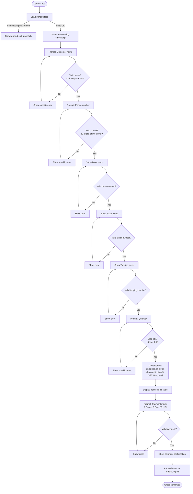

# SliceMatic Ordering System — Product Requirements Document

**Project:** SliceMatic Digital Ordering System
**Stage:** 1 (Part A of 2) — Product Requirements Document
**Prepared for:** SliceMatic (New Ashok Nagar, Delhi) — Founder: Mr. Rajan Sharma
**Document status:** Draft v1.0 for client review
**Date:** 23 June 2026

---

## 0. Purpose of this Document

This PRD defines *what* the SliceMatic ordering system must do, precisely enough that an
engineer who has never spoken to the client can build it correctly. It is the single source
of truth for the build. Section 8 ("Open Questions") lists decisions we need the client to
confirm before development — please review that section first, as those answers may change
parts of this spec.

---

## 1. Product Vision

SliceMatic's ordering system replaces error-prone manual phone ordering with a guided digital
flow that validates customer details, builds an itemised bill (pricing, quantity discounts,
18% GST and payment), and persists every order in a structured, analysable format. It serves
two users at once: the **customer**, who gets a fast, consistent, transparent ordering
experience, and the **outlet owner**, who gets operational consistency (no manual pricing or
GST errors, no staff tied to a phone line) plus the order-level data needed to run the unit
economics of the business. In one line: it turns every phone call into a clean, priced,
recorded transaction.

---

## 2. Functional Requirements

Each requirement has an ID, a description, and acceptance criteria (AC). "The system" refers
to the ordering application.

### FR-1 — Customer Onboarding
- **FR-1.1 Name capture.** Collect the customer's name.
  - AC: Accept alphabets and spaces only. Minimum 2, maximum 40 characters. Reject anything
    else with a specific message and re-prompt.
- **FR-1.2 Phone capture.** Collect a 10-digit Indian mobile number.
  - AC: Exactly 10 digits, first digit must be 6, 7, 8 or 9. Reject otherwise and re-prompt.
- **FR-1.3 Session timestamp.** Record the timestamp at the start of each new ordering session.

### FR-2 — Menu Browsing (loaded from files at runtime)
- **FR-2.1** Load `Types_of_Base.txt`, `Types_of_Pizza.txt`, `Types_of_Toppings.txt` at startup.
  Each line is `ID;Name;Price`.
- **FR-2.2** Display each category as a numbered list showing name and price in INR.
- **FR-2.3** Menu content must come entirely from the files — no menu items hardcoded in the
  application. (The data can change without a code change.)
  - AC: If the files are edited/replaced with a valid menu, the app shows the new menu with no
    code change.

### FR-3 — Item Selection
- **FR-3.1** The customer composes one pizza configuration: **one Base + one Pizza + one
  Topping** *(topping count pending client confirmation — see Q3)*.
- **FR-3.2** Selection is by item **number only** from the displayed list.
  - AC: Reject out-of-range numbers, letters, and empty input with a specific message; re-prompt.

### FR-4 — Quantity Selection
- **FR-4.1** Accept an integer quantity from **1 to 10**.
  - AC: Reject 0, negatives, values > 10, floats (e.g. `2.5`) and non-numeric input (e.g.
    `three`) with a specific message; re-prompt.
- **FR-4.2** Maximum outlet capacity is 10 pizzas per order; reject any value above 10 with an
  explanation.

### FR-5 — Pricing Engine
The bill is computed in this exact order:
- **FR-5.1 Unit price** = Base price + Pizza price + Topping price.
- **FR-5.2 Subtotal** = Unit price × Quantity.
- **FR-5.3 Discount** = 10% of Subtotal **if Quantity ≥ 5**, else 0. Show the discount as a
  line on the bill when applied.
- **FR-5.4 Taxable amount** = Subtotal − Discount.
- **FR-5.5 GST** = 18% of the Taxable amount (i.e. GST is charged on the **post-discount**
  total).
- **FR-5.6 Final payable** = Taxable amount + GST.
- **FR-5.7** All money values rounded to 2 decimal places; INR currency shown on every line.

> Worked example (from the client's reference model): Base Cheese Burst ₹229 + Pizza BBQ
> Chicken ₹379 + Topping Extra Cheese ₹69 = ₹677 unit. Qty 5 → Subtotal ₹3,385 → Discount
> (10%) ₹338.50 → Taxable ₹3,046.50 → GST (18%) ₹548.37 → **Total ₹3,594.87**.

### FR-6 — Order Summary & Bill
- **FR-6.1** Display an itemised bill: Base + Pizza + Topping (per unit), quantity, unit price,
  subtotal.
- **FR-6.2** Show discount amount (if applicable), GST @ 18% on the post-discount total, and
  final payable.
- **FR-6.3** The bill must be a structured/visual component (table), not a plain block of text;
  columns aligned, totals clearly marked.

### FR-7 — Payment Flow
- **FR-7.1** Offer exactly three modes: **1. Cash, 2. Card, 3. UPI.**
- **FR-7.2** Confirm the chosen mode and show a mode-appropriate confirmation message.
- **FR-7.3** Reject any invalid payment selection and prompt to retry.

### FR-8 — Order Persistence
- **FR-8.1** Append every **completed** order to `orders_log.txt`.
- **FR-8.2** Each record includes: timestamp, customer name, phone, item selections (base,
  pizza, topping), unit prices, quantity, subtotal, discount, GST, final total, payment mode.
- **FR-8.3** Format: one order per block, fields pipe-separated (`|`) within a line, a blank
  line between orders — so the log is machine-parseable for later business analysis.

---

## 3. Non-Functional Requirements

### NFR-1 — Input Validation Rules (summary table)
| Field | Rule |
|---|---|
| Name | Alphabets + spaces only; 2–40 chars; not blank/whitespace-only |
| Phone | Exactly 10 digits; first digit ∈ {6,7,8,9} |
| Quantity | Integer 1–10 only; no floats, strings, 0, negatives, >10 |
| Menu selection | Valid list number only; in range; not letters/blank |
| Payment | One of {1,2,3} only |

### NFR-2 — Error Messages
Every rejection must produce a **specific, helpful** message (state what was wrong and what is
expected) and re-prompt — never a generic failure, never a crash. Example: phone `1234567890`
→ *"Phone must be 10 digits and start with 6, 7, 8 or 9. Please re-enter."*

### NFR-3 — Edge Cases (all must be handled with no unhandled exception)
1. Name with only spaces.
2. Phone with 10 digits but starting with 1.
3. Quantity = 0 and quantity = 11.
4. Item selection = 0 or greater than menu length.
5. A price number entered instead of an item number.
6. Empty input at every prompt.
7. Non-integer at quantity (e.g. `three`, `2.5`).
8. A menu file with a missing price field (malformed line).

### NFR-4 — Orders Log Data Format
Pipe-separated, one order per block, blank line between blocks. Proposed field order:
```
timestamp | name | phone | base | pizza | topping | unit_price | quantity | subtotal | discount | gst | total | payment_mode
```
Format must remain stable so downstream analysis (Stage 1 Part B metrics, Stage 3 dashboard)
can parse it reliably.

### NFR-5 — Graceful Failure Modes
- Missing or malformed menu file → clear error message, graceful exit (no stack trace to user).
- Malformed line inside a menu file (e.g. missing price, non-numeric price) → skip/validate
  defensively; the application must not crash.
- The system must run end-to-end without crashing on **any** valid or invalid input.

### NFR-6 — Robustness to Menu Changes
Menu files may be edited or swapped at any time. Parsing must strip whitespace, tolerate blank
lines, validate that price is numeric, and handle a different number of items per file.

### NFR-7 — Usability
The flow is presented as a sequence of steps (not one giant form). Prices and totals are always
visible in INR. Re-prompts keep the customer in context rather than restarting the order.

---

## 4. User Flow Diagram

End-to-end journey from launch to order confirmation, including every decision node and error
branch. (Rendered as a Mermaid flowchart — displays in Notion / GitHub / most Markdown viewers.)



---

## 5. Drawbacks Analysis

An honest assessment of the system **as specified** — not just its strengths.

### 5.1 Architectural limitations
- **Flat-file storage does not scale.** `orders_log.txt` is appended sequentially. At ~1,000+
  orders the file becomes slow to read, has no indexing, no querying, and no concurrency
  control — two simultaneous orders could interleave or corrupt a line. This is acceptable for
  an MVP but is the first thing that breaks at volume. *(Addressed in Stage 3 via a database.)*
- **Single-session, single-user.** The MVP assumes one order at a time. Real delivery demand is
  concurrent (peak-hour bursts); the spec has no concurrency model.
- **No persistence of menu/version.** If the menu file changes between orders, past orders in
  the log have no record of which menu/price version was in effect.

### 5.2 Functional gaps for a real ordering business
- **No delivery address captured.** A delivery business cannot deliver without an address; the
  spec only collects name + phone. *(See Q1.)*
- **Single-configuration orders.** The spec models one Base+Pizza+Topping × quantity. A customer
  who wants two *different* pizzas in one order cannot be served — no true cart. *(See Q2.)*
- **No real payment processing.** Payment is a selection + confirmation only; no money actually
  moves for Card/UPI. Fine for an MVP, not for production.
- **No order tracking, cancellation, or modification** after confirmation.
- **No customer accounts / order history** at the MVP stage (added only in Stage 3 for the AI
  feature).
- **No inventory or stock-out handling.** The system will happily sell a pizza whose ingredients
  are unavailable.

### 5.3 What breaks at 1,000 orders
- File read/parse for any analysis becomes a full-file scan.
- No deduplication or order IDs → hard to reference a specific order.
- Concurrent writes risk corrupting the log.
- No backups → a single file loss wipes all business data.

### 5.4 Missing for production deployment
Authentication, a database with proper schema and indexes, real payment gateway integration,
delivery address + geocoding + rider assignment, order status lifecycle, monitoring/alerting,
data backup, GST-compliant invoice numbering, and an admin view. *(Most are deliberately
deferred to Stage 3.)*

---

## 6. Cost vs Value Analysis

### 6.1 Estimated build effort (MVP — Stage 2 scope)
| Work item | Est. effort (hrs) |
|---|---|
| Menu file loader + defensive parsing | 3–4 |
| Input validation (name, phone, qty, selection, payment) | 4–5 |
| Pricing engine (discount + GST + rounding) | 2–3 |
| Bill rendering (structured table component) | 2–3 |
| Payment flow + confirmations | 1–2 |
| Order persistence (parseable log) | 2 |
| Edge-case hardening + testing (all 8 cases) | 4–5 |
| UI assembly / step-driven flow | 3–4 |
| **Total (MVP)** | **~21–28 hrs** |

*(Indicative full-stack Stage 3 effort is materially larger — frontend, database, auth,
dashboard, AI feature — and is scoped separately.)*

### 6.2 Measurable value to the outlet
- **Operational efficiency:** removes manual price/discount/GST math (eliminates billing
  errors); frees the counter/billing staff from being tied to a phone line; consistent bills
  every time.
- **Data captured:** every order recorded in a parseable format → enables AOV, top-selling
  items, peak-hour analysis, weekday/weekend split, and break-even tracking — the exact inputs
  the owner needs to manage unit economics (Part B). Today this data does not exist.
- **Customer experience:** faster, transparent ordering with an itemised bill; fewer disputes
  over price; consistent discount application.
- **Strategic:** the order log is the foundation for the Stage 3 admin dashboard and AI
  features (recommendations / demand forecasting), which directly target higher AOV and better
  capacity planning.

**Net read:** ~1 working-week of build effort produces a system that removes recurring billing
errors, recovers staff time, and — most importantly — starts capturing the order data the
business currently has none of. High value-to-effort ratio for the MVP.

---

## 7. Assumptions

1. One order = one Base + one Pizza + one Topping, multiplied by quantity (per the client's
   reference bill). *Pending confirmation — Q2, Q3.*
2. The 10% discount applies to the pre-tax subtotal when quantity ≥ 5; GST is then charged on
   the post-discount amount.
3. GST is a flat 18% on home delivery, added at billing, excluded from the P&L (pass-through).
4. Prices in menu files are GST-exclusive.
5. No delivery fee is charged to the customer (delivery cost is absorbed as a business cost per
   the reference model). *Pending confirmation — Q5.*
6. Currency is INR throughout; values rounded to 2 decimals.

---

## 8. Open Questions — Clarification Needed from Client

These are genuine ambiguities in the brief that affect the build. We recommend resolving them
before development starts; defaults we will assume (if no answer) are noted.

| # | Question | Why it matters | Default if unanswered |
|---|---|---|---|
| **Q1** | Should we capture a **delivery address** (and is delivery in scope for this version)? | A delivery business can't deliver without one; impacts data model and flow. | Out of scope for MVP; name + phone only. |
| **Q2** | Can one order contain **multiple different pizzas** (a true cart), or is it one configuration × quantity? | Changes the entire order/data model and bill structure. | One configuration × quantity (matches reference bill). |
| **Q3** | Is a topping **mandatory**, and can a customer pick **more than one** topping (or none)? | Reference model says "avg 1 topping"; the brief lists "Topping" singular. Affects pricing and selection step. | Exactly one mandatory topping per pizza. |
| **Q4** | Is there a **delivery fee or packaging charge** added to the customer's bill? | Reference model treats these as business costs, not customer charges. Affects bill lines. | No customer-facing delivery/packaging fee. |
| **Q5** | For **Card/UPI**, do we need real payment processing now, or is selection + confirmation sufficient for this version? | Real gateways need integration, keys, reconciliation. | Selection + confirmation only (no live payment) for MVP. |
| **Q6** | Should the **discount be configurable** (threshold/percentage) or hard-fixed at qty ≥ 5 / 10%? | Owner may want to run promotions; graders also test changing the threshold. | Keep the rule in one place so it can be changed easily; default qty ≥ 5 / 10%. |
| **Q7** | Any **minimum order value** or free-delivery threshold? | Common QSR rule; affects checkout validation. | No minimum order value. |
| **Q8** | Should each order get a **human-readable order ID / invoice number**? | Needed to reference orders and for GST-compliant invoicing later. | Use timestamp as the identifier for MVP. |
| **Q9** | Confirm **GST rate (18%)** and that prices in the menu files are **GST-exclusive**. | If prices are GST-inclusive, the entire bill math changes. | 18%, prices GST-exclusive. |
| **Q10** | What should happen to a **partially completed order** the customer abandons before payment? | Affects whether/how incomplete sessions are logged. | Not written to `orders_log.txt`; only completed orders are persisted. |

---

## 9. Out of Scope (this version)

Aggregator (Zomato/Swiggy) integration, loyalty/coupon codes beyond the qty discount,
multi-outlet support, live order tracking, inventory management, refunds/cancellations, and
SMS/email notifications. These may be considered in future phases.

---

*Prepared as Stage 1, Part A. Part B (Business Unit Economics) follows as a companion section in
the same submission.*
