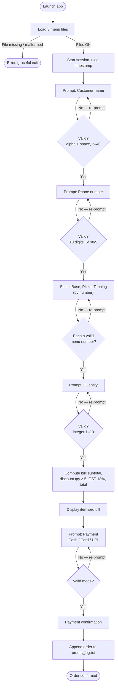
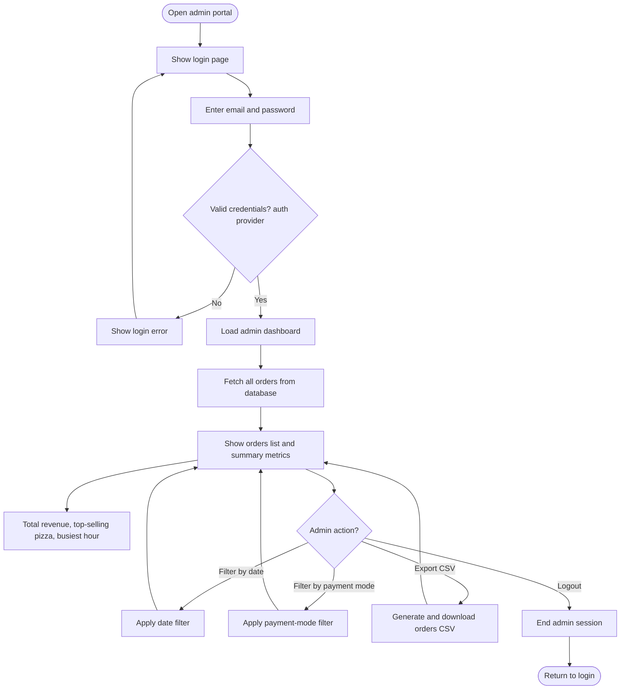

# SliceMatic Ordering System — Product Requirements Document

**Project:** SliceMatic Digital Ordering System
**Stage:** 1 (Part A of 2) — Product Requirements Document
**Prepared for:** SliceMatic (New Ashok Nagar, Delhi) — Founder: Mr. Rajan Sharma
**Document status:** Draft v1.0 for client review
**Date:** 23 June 2026

---

## 1. Product Vision

SliceMatic's ordering system replaces error-prone manual phone ordering with a guided digital
flow that validates customer details, builds an itemised bill (pricing, quantity discounts,
18% GST and payment), and persists every order in a structured, analysable format. 
It solves two problems at once: 
1. The **customer**, who gets a fast, consistent, transparent ordering experience
2. The **outlet owner**, who gets operational consistency (no manual pricing or GST errors, no
staff tied to a phone line) plus the order-level data needed to run the unit economics of the
business. 

### 1.1 User Personas

The three people the system serves — the staff who operate it, the customer it serves, and the
owner who runs the business on its data.

| Persona | Who they are | Goals | What they need from the system | Pain points it removes |
|---|---|---|---|---|
| 🧑‍🍳 **Order-taking staff** | Counter / billing person who enters orders | Take orders quickly and accurately; no manual math | A guided step-by-step flow; automatic pricing, discount and GST; instant itemised bill | No more slow phone orders, hand-calculated bills, or pricing mistakes |
| 🍕 **Customer** | Person placing the order (18–35, within ~5 km) | A fast, transparent order with a clear, fair bill | Quick ordering, an itemised bill, consistent pricing and discounts | No more inconsistent quotes, billing disputes, or long waits |
| 🧑‍💼 **Owner / Admin** | Mr. Rajan Sharma — runs the outlet | Understand sales, margins and demand to make decisions | A complete, structured record of every order; sales and revenue summaries | No more "no data" — operating blind on unit economics |

---

## 2. Scope — MVP (Stage 2) vs Stage 3

This PRD specifies the **Stage 2 MVP** in full, testable detail. Stage 3 capabilities are described
for context (see §11) but are **not** part of the graded MVP deliverable. The table below draws the
line explicitly so there is no ambiguity about what gets built now.

| Capability | MVP (Stage 2) | Stage 3 (full-stack) |
|---|---|---|
| Platform | Command-line / step-driven flow | Web app (frontend + database + auth) |
| Menu source | Loaded from the three `.txt` files at runtime | Same data, served from a database |
| Customer ordering | Guided form: name → phone → base → pizza → topping → qty → pay | **Conversational (chat) ordering** via LLM (§11.2) |
| Validation & business rules | Full (name, phone, qty, selection, payment; discount + 18% GST) | Same rules, enforced server-side |
| Pricing engine | Deterministic (unit → subtotal → discount → GST → total) | Identical engine, reused |
| Payment | Mode selection + confirmation (no live gateway) | Real payment processing (gateway integration) |
| Persistence | Append to `orders_log.txt` (parseable) | Orders database with IDs, backups, indexing |
| Admin / reporting | Out of scope — raw log only | **Admin dashboard**: login, metrics, filters, CSV export (§11.1) |

**In one line:** the MVP is a robust, validated, file-based CLI ordering system; Stage 3 turns it
into a full-stack app with an admin dashboard and a conversational AI ordering interface.

> Detailed **assumptions** and **exclusions** that refine this scope are in **§9 (Assumptions)** and
> **§10 (Out of Scope)**.

---

## 3. Functional Requirements

Each requirement has an ID, the requirement, and its acceptance criteria.

| ID | Requirement | Acceptance criteria |
|---|---|---|
| FR-1.1 | Capture customer name | Alphabets and spaces only; 2–40 characters; reject anything else with a specific message and re-prompt |
| FR-1.2 | Capture phone number | Exactly 10 digits; first digit 6, 7, 8 or 9; reject otherwise and re-prompt |
| FR-1.3 | Log session timestamp | Record the timestamp at the start of each new ordering session |
| FR-2.1 | Load menu from files at startup | Load Types_of_Base.txt, Types_of_Pizza.txt, Types_of_Toppings.txt; each line formatted ID;Name;Price |
| FR-2.2 | Display menu | Show each category as a numbered list with name and price in INR |
| FR-2.3 | No hardcoded menu | Menu comes only from the files; editing or replacing the files shows the new menu with no code change |
| FR-3.1 | Item selection | Customer selects one Base, one Pizza and one Topping; each must resolve to a valid menu item |
| FR-3.2 | Selection by number | Selection by item number only; reject out-of-range numbers, letters and empty input with a specific message; re-prompt |
| FR-4.1 | Quantity | Accept an integer from 1 to 10; reject 0, negatives, values above 10, floats and non-numeric input; re-prompt |
| FR-4.2 | Capacity cap | Maximum 10 pizzas per order; reject any value above 10 with an explanation |
| FR-5 | Pricing engine | Compute the bill per the pricing table below |
| FR-6.1 | Itemised bill | Show Base + Pizza + Topping per unit, quantity, unit price and subtotal |
| FR-6.2 | Bill totals | Show discount (if applicable), GST @ 18% on the post-discount total, and final payable |
| FR-6.3 | Bill rendering | Render as a structured table component (not plain text); aligned columns, totals clearly marked |
| FR-7.1 | Payment modes | Offer exactly three modes: Cash, Card, UPI |
| FR-7.2 | Payment confirmation | Confirm the chosen mode; show a mode-appropriate confirmation message |
| FR-7.3 | Payment validation | Reject any invalid payment selection and prompt to retry |
| FR-8.1 | Persist order | Append every completed order to orders_log.txt |
| FR-8.2 | Record fields | timestamp, name, phone, item selections, unit prices, quantity, subtotal, discount, GST, final total, payment mode |
| FR-8.3 | Log format | One order per block; fields pipe-separated within a line; a blank line between orders (machine-parseable) |

### FR-5 — Pricing Engine (computed in this exact order)

| Step | Calculation |
|---|---|
| FR-5.1 Unit price | Base price + Pizza price + Topping price |
| FR-5.2 Subtotal | Unit price × Quantity |
| FR-5.3 Discount | 10% of Subtotal if Quantity ≥ 5, else 0 (shown as a bill line when applied) |
| FR-5.4 Taxable amount | Subtotal − Discount |
| FR-5.5 GST | 18% of the Taxable amount (charged on the post-discount total) |
| FR-5.6 Final payable | Taxable amount + GST |
| FR-5.7 Rounding | All money values to 2 decimals; INR shown on every line |

> Worked example (from the client's reference model): Base Cheese Burst ₹229 + Pizza BBQ
> Chicken ₹379 + Topping Extra Cheese ₹69 = ₹677 unit. Qty 5 → Subtotal ₹3,385 → Discount
> (10%) ₹338.50 → Taxable ₹3,046.50 → GST (18%) ₹548.37 → **Total ₹3,594.87**.

---

## 4. Non-Functional Requirements

### 4.1 Input Validation Rules

| Field | Rule |
|---|---|
| Name | Alphabets and spaces only; 2–40 chars; not blank or whitespace-only |
| Phone | Exactly 10 digits; first digit one of 6, 7, 8, 9 |
| Quantity | Integer 1–10 only; no floats, strings, 0, negatives, above 10 |
| Menu selection | Valid list number only; in range; not letters or blank |
| Payment | One of 1, 2, 3 only |

### 4.2 Quality & Reliability Requirements

| ID | Area | Requirement |
|---|---|---|
| NFR-2 | Error messages | Every rejection gives a specific, helpful message stating what was wrong and what is expected, then re-prompts — never a generic failure, never a crash |
| NFR-3 | Edge cases | All edge cases in 4.3 handled with no unhandled exception |
| NFR-4 | Orders log format | Pipe-separated, one order per block, blank line between blocks; stable field order (see below) so downstream analysis can parse it reliably |
| NFR-5 | Graceful failure | Missing or malformed menu file → clear error and graceful exit (no stack trace); malformed lines validated defensively; no crash on any valid or invalid input |
| NFR-6 | Menu-change robustness | Strip whitespace, tolerate blank lines, validate price is numeric, handle a varying number of items per file |
| NFR-7 | Usability | Step-by-step flow (not one giant form); prices and totals always in INR; re-prompts keep the customer in context |

*Example error message (NFR-2): phone `1234567890` → "Phone must be 10 digits and start with 6, 7, 8 or 9. Please re-enter."*

**Orders log field order (NFR-4):**
```
timestamp ; name ; phone ; base ; pizza ; topping ; unit_price ; quantity ; subtotal ; discount ; gst ; total ; payment_mode
```
*(Shown with `;` separators for readability; actual log uses the pipe character as specified in FR-8.3.)*

### 4.3 Edge Cases (all handled with no unhandled exception)

| # | Edge case | Required handling |
|---|---|---|
| 1 | Name with only spaces | Reject as invalid name; re-prompt |
| 2 | Phone with 10 digits starting with 1 | Reject; require first digit 6/7/8/9 |
| 3 | Quantity = 0 or 11 | Reject; require an integer 1–10 |
| 4 | Item selection = 0 or above menu length | Reject; require an in-range number |
| 5 | Price number entered instead of item number | Reject if out of range; treat as invalid selection |
| 6 | Empty input at any prompt | Reject; re-prompt with guidance |
| 7 | Non-integer at quantity (e.g. three, 2.5) | Reject; require an integer |
| 8 | Menu file with a missing price field | Skip or validate the line defensively; do not crash |

---

## 5. User Flow — Customer Ordering

End-to-end journey from launch to order confirmation, including every decision node and error
branch — the core flow delivered in the MVP (Stage 2). (Rendered as a Mermaid flowchart —
displays in Notion / GitHub / most Markdown viewers.)

> The owner/admin journey is a **Stage 3** capability and is documented in **§11.1**.



---

## 6. Drawbacks & Risk Analysis

An honest assessment of the system **as specified**. Two distinct things are covered here:
**§6.1–6.3 drawbacks** are inherent limitations of the chosen MVP design; **§6.4 risks** are things
that could go wrong during the build or in operation, each rated by likelihood × impact with a
mitigation.

### 6.1 Architectural limitations
- **Flat-file storage does not scale.** `orders_log.txt` is appended sequentially. At ~1,000+
  orders the file becomes slow to read, has no indexing, no querying, and no concurrency
  control. This is acceptable for an MVP but is the first thing that breaks at volume.
- **Single-session, single-user.** The MVP assumes one order at a time and has no concurrency
  model. The moment the design is pushed beyond single-session use, simultaneous writes to the
  flat file can interleave and corrupt a line.
- **No persistence of menu/version.** If the menu file changes between orders, past orders in
  the log have no record of which menu/price version was in effect.

### 6.2 Functional gaps for a real ordering business
- **Single-configuration orders.** The spec models one Base+Pizza+Topping × quantity. A customer
  who wants two *different* pizzas in one order cannot be served — no true cart.
- **No real payment processing.** Payment is a selection + confirmation only; no money actually
  moves for Card/UPI. Fine for an MVP, not for production.
- **No order tracking, cancellation, or modification** after confirmation.
- **No inventory or stock-out handling.** The system will happily sell a pizza whose ingredients
  are unavailable.

### 6.3 What breaks at 1,000 orders
*(~1,000 orders ≈ a couple of months at a single outlet's volume.)*
- File read/parse for any analysis becomes a full-file scan.
- No deduplication or order IDs → hard to reference a specific order.
- Concurrent writes risk corrupting the log.
- No backups → a single file loss wipes all business data.

### 6.4 Risk Register
*(Likelihood and Impact are rated for the MVP as specified; mitigations in place or planned.)*

| ID | Risk | Likelihood | Impact | Mitigation |
|---|---|---|---|---|
| R1 | Orders log corrupted by interrupted or concurrent writes | Low (single-session MVP) | High | Append-only, one completed block per order; Stage 3 moves to a database with transactions |
| R2 | Edited / malformed menu file breaks startup | Medium | High | Defensive parsing (NFR-5/6): skip bad lines, validate price, graceful exit — never a crash |
| R3 | Pricing, discount or GST computed incorrectly | Low | High | Single pricing engine (FR-5), worked-example regression test, all 8 edge cases tested |
| R4 | Customer PII (name + phone) stored in plaintext, no access control | High | Medium | Acknowledged MVP limitation; restrict file access; Stage 3 moves to an authenticated database |
| R5 | Data loss — single file, no backup | Medium | High | Periodic file backup as an interim control; Stage 3 database with managed backups |
| R6 | *(Stage 3)* LLM unavailable or mis-extracts a field | Medium | Medium | Graceful fallback to the Stage 2 form flow (AI-11); per-field confirmation; pricing stays deterministic |
| R7 | Scope creep — Stage 3 features pulled into the MVP | Medium | Medium | Explicit scope boundary (§2) and out-of-scope list (§10) agreed with the client up front |

---

## 7. Cost vs Value Analysis

### 7.1 Estimated build effort (MVP — Stage 2 scope)
| Work item | Est. effort (hrs) |
|---|---|
| Menu file loader + defensive parsing | 3–4 |
| Input validation (name, phone, qty, selection, payment) | 4–5 |
| Pricing engine (discount + GST + rounding) | 2–3 |
| Bill rendering (structured table component) | 2–3 |
| Payment flow + confirmations | 1–2 |
| Order persistence (parseable log) | 2 |
| Edge-case hardening + testing (all 8 cases) | 4–5 |
| UI assembly / step-driven flow | 3–4 |
| **Total (MVP)** | **~21–28 hrs** |

*(Indicative full-stack Stage 3 effort is materially larger — frontend, database, auth,
dashboard, AI feature — and is scoped separately; see §11.)*

> **Note — Admin dashboard:** the admin flow (see §11.1) is a **Stage 3** capability and is **not**
> included in the ~21–28 hr MVP estimate above. Its effort (authentication, dashboard metrics,
> date/payment filters, CSV export) is part of the separately-scoped full-stack build.

### 7.2 Measurable value to the outlet
- **Operational efficiency:** removes manual price/discount/GST math (eliminates billing
  errors); frees the counter/billing staff from being tied to a phone line; consistent bills
  every time.
- **Data captured:** every order recorded in a parseable format → enables AOV, top-selling
  items, peak-hour analysis, weekday/weekend split, and break-even tracking — the exact inputs
  the owner needs to manage unit economics (Part B). Today this data does not exist.
- **Customer experience:** faster, transparent ordering with an itemised bill; fewer disputes
  over price; consistent discount application.
- **Strategic:** the order log is the foundation for the Stage 3 admin dashboard and AI
  features (recommendations / demand forecasting), which directly target higher AOV and better
  capacity planning. See §11.

**Net read:** ~1 working-week of build effort produces a system that removes recurring billing
errors, recovers staff time, and — most importantly — starts capturing the order data the
business currently has none of. High value-to-effort ratio for the MVP.

---

## 8. Expected Outcomes & Success Metrics

What success looks like — the measurable outcomes the system must deliver. These tie directly to
the unit economics in Part B (the order data captured here is what powers AOV, peak-hour and
break-even tracking).

| # | Outcome | Success metric / target |
|---|---|---|
| O-1 | Accurate billing every time | 100% of bills correct — discount applied at qty ≥ 5, 18% GST on post-discount total; zero manual calculation errors |
| O-2 | No crashes on any input | 0 unhandled exceptions across all 8 edge cases and the grader's swapped menu files |
| O-3 | Every order captured | 100% of completed orders written to the log in a parseable, consistent format |
| O-4 | Menu changes need no code | A new or edited menu file loads at runtime with zero code changes |
| O-5 | Faster, consistent ordering | Order completed in under ~2 minutes; consistent discount and GST on every order |
| O-6 | Staff time recovered | Counter/billing staff freed from manual phone order-taking |
| O-7 | Owner can run the numbers | AOV, top-selling item, busiest hour, weekday/weekend split and break-even all derivable from the order log (Part B metrics) |
| O-8 | *(Stage 3 — see §11.2)* Natural-language ordering | Agent extracts all 7 fields, confirms each, handles ambiguity, and falls back gracefully |
| O-9 | *(Stage 3 — see §11)* Digital adoption | Share of orders placed through the system (vs phone) trends up after launch |

**Primary outcome:** SliceMatic moves from *no order data and manual, error-prone billing* to
*consistent automated billing with a complete, analysable record of every order* — the
foundation for every downstream business decision.

---

## 9. Assumptions

1. One order = one Base + one Pizza + one Topping, multiplied by quantity (per the client's
   reference bill). 
2. The 10% discount applies to the pre-tax subtotal when quantity ≥ 5; GST is then charged on
   the post-discount amount.
3. GST is a flat 18% on home delivery, added at billing, excluded from the P&L (pass-through).
4. Prices in menu files are GST-exclusive.
5. Currency is INR throughout; values rounded to 2 decimals.
6. Exactly one mandatory topping per pizza; name + phone only (no delivery address) for this
   version; Card/UPI is selection + confirmation, not live payment processing.

---

## 10. Out of Scope (this version)

1. Aggregator (Zomato/Swiggy) integration
2. Loyalty/coupon codes beyond the qty discount
3. Multi-outlet support
4. Live order tracking
5. Inventory management
6. Refunds/cancellations
7. SMS/email notifications
8. Admin dashboard — login, order filters, revenue/sales summaries, CSV export *(deferred to Stage 3; see §11.1)*

---

## 11. Stage 3 — Future Scope *(not in the Stage 2 MVP)*

This section collects every capability that is **out of scope for the Stage 2 MVP** and planned for
the Stage 3 full-stack build. It is included here for completeness so the full system is understood
end to end; the MVP sections above remain the buildable, graded deliverable, and cross-reference
this section where relevant.

### 11.1 Admin Flow

The owner/admin journey: authenticated login, then a dashboard built on the persisted order data
(filters, revenue and sales summaries, CSV export). Backed by an authentication provider
(e.g. Supabase) and the orders database in the full-stack build.



### 11.2 AI Feature — Conversational Ordering Interface *(Option B)*

For Stage 3, SliceMatic will implement **Option B** from the brief: a conversational (chat)
ordering interface powered by an LLM via **OpenRouter**, replacing the step-by-step form with
natural-language ordering. All Stage 2 business logic (validation, pricing, discount, GST,
persistence) still applies — the LLM handles *understanding*, not *calculation*.

#### 11.2.1 Overview

The customer places an order by typing naturally — e.g. *"2 cheese burst pizzas with extra
cheese, paying by UPI, name Rajan, 9876543210."* An LLM agent extracts the required fields,
confirms each one, re-prompts for anything missing or invalid, handles vague requests, and
finalises the order. If the agent cannot parse the request, it falls back to the structured
Stage 2 flow.

#### 11.2.2 Functional Requirements

| ID | Requirement | Detail |
|---|---|---|
| AI-1 | Natural-language intake | Customer orders in free text via a chat interface (replaces the form flow) |
| AI-2 | Field extraction | Agent extracts the 7 required fields: name, phone, quantity, base, pizza, topping, payment mode |
| AI-3 | Per-field confirmation | Agent reads back each extracted field for the customer to confirm or correct |
| AI-4 | Ambiguity handling | Vague input (e.g. "something spicy") → agent suggests matching items from the live menu (Peri-Peri, Jalapenos, BBQ Chicken) |
| AI-5 | Missing/invalid re-prompt | Agent re-prompts for any field that is missing or fails validation, one at a time |
| AI-6 | Menu grounding | Agent may only choose bases/pizzas/toppings that exist in the live menu/DB; it cannot invent items or prices |
| AI-7 | Deterministic pricing | Agent extracts intent only; the validated pricing engine computes subtotal, discount, GST and total — the LLM never computes money |
| AI-8 | Business-rule parity | All Stage 2 rules enforced: name 2–40 alpha+space, phone 10-digit 6/7/8/9, qty 1–10, 10% discount at qty ≥ 5, 18% GST on post-discount total |
| AI-9 | Confirmation before commit | Agent reads back the full order and final payable before finalising |
| AI-10 | Persistence | Completed chat orders saved to the same orders store, tagged with order source = "chat" |
| AI-11 | Graceful fallback | If the LLM/API is unavailable or parsing fails after a few attempts, fall back to the structured form flow |

#### 11.2.3 Guardrails & Non-Functional Requirements

- **No hallucinated items or prices** — the live menu is provided to the agent (system prompt or
  tool call); selections are validated against the DB before pricing.
- **Math stays deterministic** — pricing, discount and GST are computed by the same server-side
  engine as the form flow, never by the LLM.
- **Input safety** — off-topic, abusive, or prompt-injection input is deflected; the agent stays
  on the ordering task.
- **Graceful degradation** — LLM/API failure falls back to the Stage 2 form flow so an order can
  always be placed.
- **Transparency** — the final itemised bill (same format as the form flow) is shown before
  payment.

#### 11.2.4 Model, Prompt & Documentation

- **Provider:** OpenRouter API (mandatory per brief). The specific model and rationale are
  documented in the README (chosen at Stage 3 — a strong instruction-following model with
  reliable structured extraction).
- **System prompt:** documented in the README (brief requirement). It defines the agent's role,
  the 7 fields to collect, the live menu, the validation rules, the instruction to confirm each
  field, and the rule never to compute prices.
- **Ownership:** per the brief, the first team to commit an AI feature owns it — this Option B
  implementation is registered as Group 3's.

#### 11.2.5 Example Chat Exchange

A worked conversation showing field extraction, ambiguity handling, validation, deterministic
pricing and confirmation. *(Prices below are illustrative.)*

| Turn | Message |
|---|---|
| 🧑 **Customer** | "Hi, I want a cheese burst, something spicy on top — 3 of them." |
| 🤖 **Agent** | "Sure! I've set **Cheese Burst** as your base. For *something spicy* we have **Jalapenos**, **Peri-Peri Drizzle** or **BBQ Chicken** — which would you like? And which pizza: **Pepperoni**, **BBQ Chicken** or **Paneer Tikka**?" |
| 🧑 **Customer** | "Peri-peri, and the bbq chicken pizza." |
| 🤖 **Agent** | "Got it — **BBQ Chicken** pizza on a **Cheese Burst** base with **Peri-Peri Drizzle**, quantity **3**. Could I have your name and 10-digit phone number?" |
| 🧑 **Customer** | "Rajan, 98765 43210" |
| 🤖 **Agent** | "Thanks, Rajan ✅. Last thing — how would you like to pay: **Cash**, **Card** or **UPI**?" |
| 🧑 **Customer** | "UPI" |
| 🤖 **Agent** | "Here's your order:<br>**3 × (Cheese Burst + BBQ Chicken + Peri-Peri Drizzle)** @ ₹677 = **₹2,031.00**<br>Discount: ₹0.00 *(applies at qty ≥ 5)*<br>GST (18%): ₹365.58<br>**Total payable: ₹2,396.58** — via UPI<br>Shall I confirm this order?" |
| 🧑 **Customer** | "Yes" |
| 🤖 **Agent** | "Order confirmed 🎉 — thanks, Rajan! Your pizzas are on the way. (Order saved.)" |

> **Note on guardrails in action:** the agent only offered items that exist in the live menu
> (AI-6), confirmed each field before committing (AI-3, AI-9), and let the **pricing engine** —
> not the LLM — compute the discount and GST (AI-7). The 10% discount did **not** apply because
> quantity was below 5.

---

## 12. Product Roadmap

The phased path from the MVP to the full product. This consolidates the scope boundary (§2) and the
Stage 3 detail (§11) into a single timeline; "future" items are directional, not committed.

| Phase | Theme | Key capabilities | Status |
|---|---|---|---|
| **Phase 1 — Stage 2 MVP** | Validated file-based ordering | CLI step-flow, input validation, pricing engine (discount + 18% GST), itemised bill, order persistence, edge-case hardening | 🔨 In build (this deliverable) |
| **Phase 2 — Stage 3 full-stack** | Web app + admin | Web UI, orders **database**, authentication, **admin dashboard** (metrics, date/payment filters, CSV export) — §11.1 | 🔜 Planned |
| **Phase 3 — Stage 3 AI** | Conversational ordering | LLM chat ordering via OpenRouter (Option B), menu-grounded extraction, deterministic pricing, graceful fallback — §11.2 | 🔜 Planned |
| **Phase 4 — Beyond** | Growth & intelligence | Aggregator integration, loyalty/coupons, demand forecasting & recommendations, multi-outlet support | 🔭 Future / directional |

> Each phase builds on the order data captured from Phase 1 — the MVP's structured log is the
> foundation for the dashboard (Phase 2), the AI features (Phase 3), and forecasting (Phase 4).

---

## 13. Competitive Landscape

Market context for where SliceMatic sits and the gap it targets.

| Competitor | Positioning | Their strength | Gap SliceMatic exploits |
|---|---|---|---|
| Domino's / Pizza Hut | National chains | Brand trust, fast delivery, slick app | Premium pricing; impersonal; no hyperlocal focus |
| Local independent pizzerias | Neighbourhood outlets | Low price, familiar taste | Manual phone ordering, inconsistent bills, no data |
| Aggregator-only cloud kitchens | Zomato/Swiggy-native | Wide reach, discovery | 20–25% commission erodes margin; no direct customer relationship |
| **SliceMatic** | **Hyperlocal, digital-first** | **Direct ordering (no commission), customisation, 30-min SLA, transparent billing + order data** | — |

> The direct-ordering advantage (no 20–25% aggregator commission) is quantified in Part B, Q2 —
> every order kept on the own-app is worth ~₹175 more in contribution.
