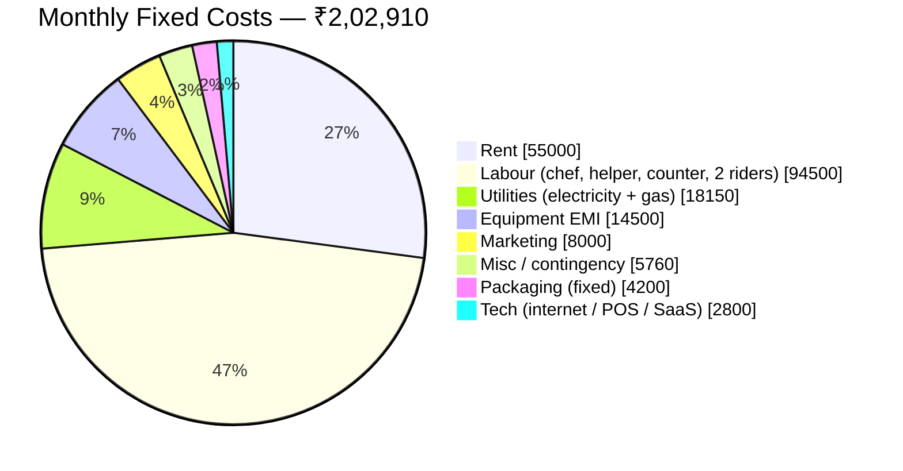
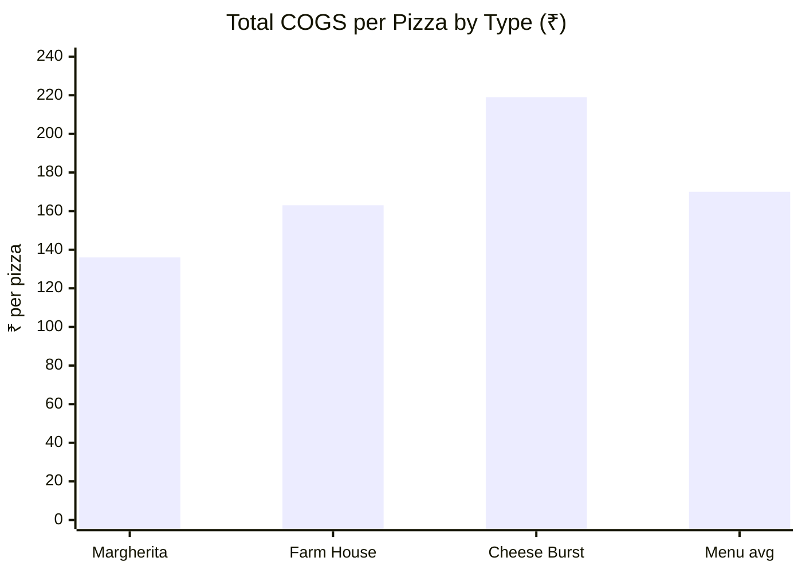
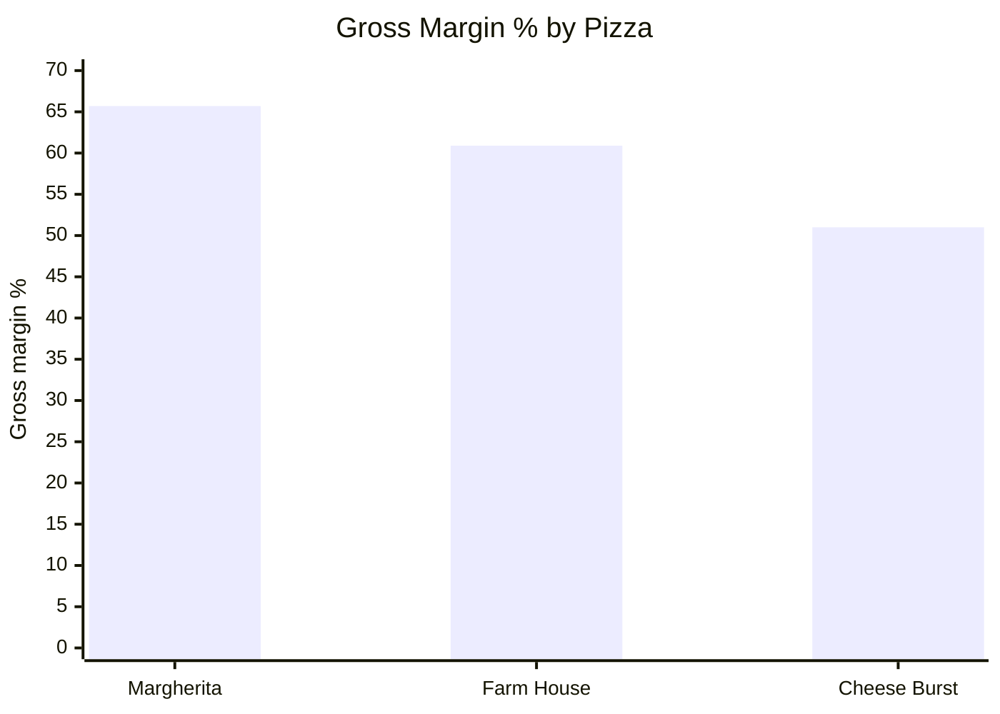
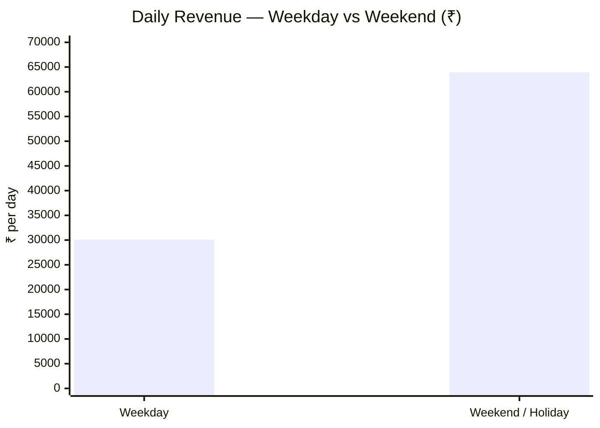
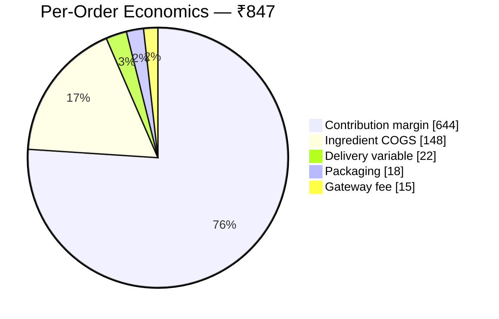
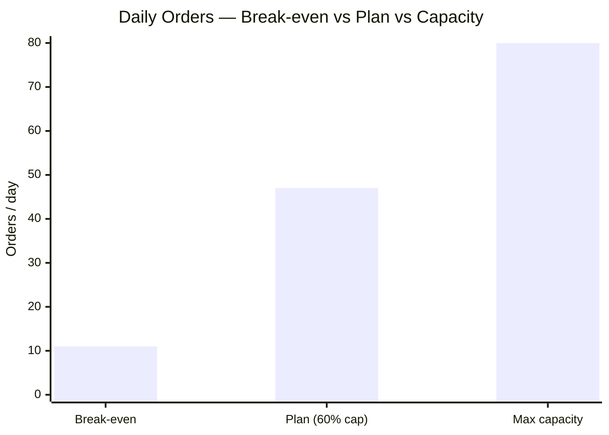
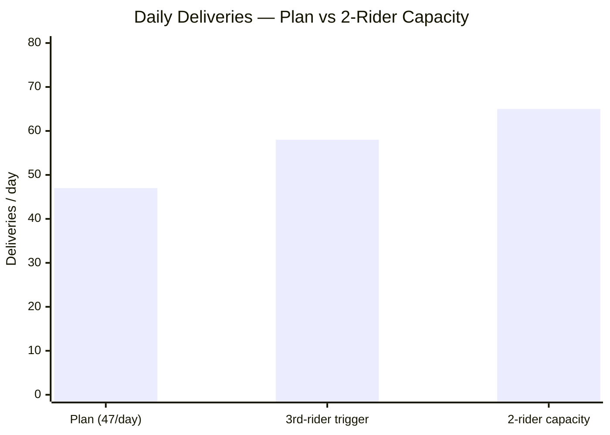
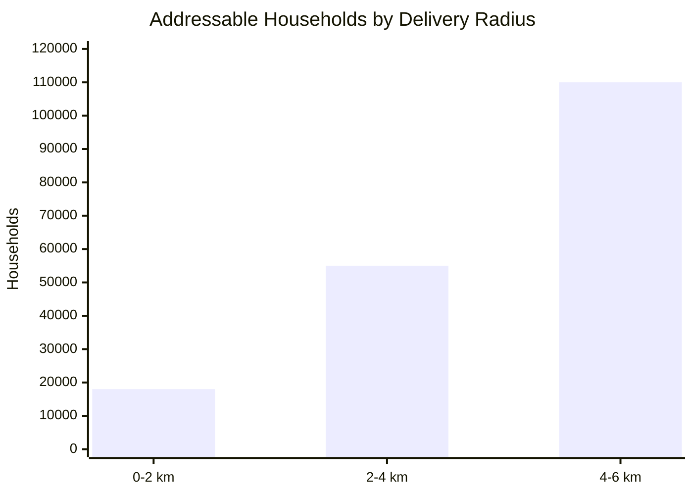

# SliceMatic — Business Unit Economics

**Project:** SliceMatic Digital Ordering System
**Stage:** 1 (Part B of 2) — Business Unit Economics
**Prepared for:** SliceMatic (New Ashok Nagar, Delhi) — Founder: Mr. Rajan Sharma
**Document status:** Draft v1.0 for client review
**Date:** 23 June 2026

---

## 0. Approach

This is a financial model for a single-outlet pizza delivery business in East Delhi. We take the
client's reference baseline (FY 2024–25 model) as the starting point, reproduce its core unit
economics, and then **stress-test it** against the six scenarios the business actually cares
about (rent shocks, aggregator commissions, ingredient inflation, etc.). Where we refine a
baseline number, the justification is noted inline. All figures are in INR; the P&L is computed
**ex-GST** (GST is a pass-through — see Section 7).

> **On the visuals:** charts in this document are Mermaid diagrams (pie / bar) that render on
> GitHub and most Markdown viewers. Each chart sits **alongside its data table** — the table holds
> the exact figures, the chart gives the at-a-glance read. (Bar charts use `xychart-beta`, which
> needs a recent Mermaid renderer; the adjacent table is the fallback if a viewer can't draw it.)

**Headline numbers (baseline, 60% capacity):**

| Metric | Value |
|---|---|
| Average Order Value (AOV) | ₹847 |
| Monthly revenue (ex-GST) | ~₹9.96 L |
| Contribution margin / order | ₹644 (76%) |
| Total monthly fixed costs | ₹2,02,910 |
| Break-even | ~315 orders/mo ≈ **11/day** |
| Operating profit (EBITDA) | ~₹7.0 L/mo |
| Payback period | ~18 months |

---

## 1. Monthly Fixed Costs

Costs incurred regardless of order volume — the minimum monthly cash outflow before any profit.

| Cost item | Detail | Monthly (₹) |
|---|---|---:|
| Kitchen rent | 1,200 sq ft commercial lease, New Ashok Nagar | 55,000 |
| Equipment EMI | 2-deck oven, mixer, refrigeration — 36-mo loan on ₹4.5L | 14,500 |
| Electricity | Commercial rate, ~1,800 units/mo | 12,600 |
| Gas / LPG | 3 commercial cylinders @ ₹1,850 | 5,550 |
| Head chef | 1 experienced pizza chef | 28,000 |
| Kitchen helper | 1 prep staff (min wage + ESI/PF) | 16,500 |
| Counter + billing | 1 person | 18,000 |
| Delivery riders | 2 riders, fixed component + fuel allowance | 32,000 |
| Internet + POS + SaaS | Broadband + POS + gateway annual fee amortised | 2,800 |
| Marketing (fixed) | Meta Ads retainer, pamphlets, GBP boost | 8,000 |
| Packaging (fixed component) | Branded boxes/bags minimum order | 4,200 |
| Misc / contingency (3%) | Maintenance, repairs, consumables | 5,760 |
| **Total fixed costs** | | **2,02,910** |

**Fixed-cost composition** *(labour and utilities grouped):*

> *Reads at a glance:* **labour (~47%)** and **rent (~27%)** together are ~74% of fixed costs —
> the two levers that matter; everything else is small.

> *Note:* Rider figure is the **fixed** salary component only. The per-delivery incentive
> (₹15/order) is a **variable** cost (Section 5).

---

## 2. COGS per Pizza — by Pizza Type

COGS per pizza = raw ingredients + packaging + per-order delivery variable. (Wholesale rates,
INA Market / Azadpur Mandi.)

| Component | Margherita (Thin) | Farm House (Thick) | Cheese Burst (premium) | Avg across menu |
|---|---:|---:|---:|---:|
| Pizza base ingredients | 38 | 45 | 72 | 52 |
| Sauce + seasoning | 12 | 14 | 14 | 13 |
| Cheese (mozzarella) | 28 | 32 | 65 | 38 |
| Pizza-specific toppings | 8 | 22 | 18 | 17 |
| Add-on topping (avg 1) | 10 | 10 | 10 | 10 |
| Packaging (box + bag) | 18 | 18 | 18 | 18 |
| Delivery variable | 22 | 22 | 22 | 22 |
| **Total COGS / pizza** | **136** | **163** | **219** | **170** |

> *Reads at a glance:* Cheese Burst costs **~61% more** to make than Margherita — almost entirely
> the cheese jump (₹28 → ₹65).

---

## 3. Gross Margin — per Pizza and by Category

| Pizza | Selling price* | COGS | Gross margin | GM % |
|---|---:|---:|---:|---:|
| Margherita (Thin) | 397 | 136 | 261 | 65.7% |
| Farm House (Thick) | 417 | 163 | 254 | 60.9% |
| Cheese Burst (premium) | 447 | 219 | 228 | 51.0% |
| **Average** | **420** | **170** | **250** | **59.5%** |

\* Selling price = cheapest base + pizza + 1 average topping. Actual order value varies; AOV of
₹847 reflects multi-pizza orders and premium selections.

**Margin by category split (illustrative, per average order line):**

| Category | Avg menu price | Approx. food cost | Approx. GM % |
|---|---:|---:|---:|
| Base | ~₹177 (avg of 5) | ₹38–72 | high (~65–75%) |
| Pizza | ~₹342 (avg of 8) | ₹20–55 | high (~80%+) |
| Topping | ~₹50 (avg of 10) | ~₹10 | very high (~80%) |

**Insight (challenge to baseline):** Margin is **inversely driven by cheese intensity**.
Cheese Burst's gross margin (51%) is ~15 pts below Margherita's (65.7%) purely because cheese
cost jumps ₹28 → ₹65. The menu's profit lever is therefore **mix**, not price: nudging customers
toward thin/thick bases and high-margin toppings lifts blended margin more than a price rise
would. This is a direct input to the Stage 3 recommendation engine.

---

## 4. Revenue Model — Monthly Projections (60% capacity)

| Metric | Weekday | Weekend/Holiday | Monthly total |
|---|---:|---:|---:|
| Days in period | 22 | 8 | 30 |
| Orders/day (60% cap) | 38 | 68 | ~47 avg |
| AOV | ₹792 | ₹940 | ₹847 |
| Daily revenue | ₹30,096 | ₹63,920 | ~₹40,500 avg |
| Monthly gross revenue | ₹6,62,112 | ₹5,11,360 | **₹11,73,472** |
| GST collected (18%, → Govt) | | | ₹1,77,564 |
| **Net revenue (ex-GST)** | | | **₹9,95,908** |

> Max capacity = 80 orders/day (1 pizza every 6 min, 2-oven setup). 60% utilisation is a
> deliberately conservative launch assumption. At 100% capacity revenue ≈ ₹19.6 L/mo.

---

## 5. Contribution Margin & Break-Even

Contribution margin per order = revenue (ex-GST) − **all** variable costs per order. It measures
how much each order contributes toward fixed costs and then profit.

| P&L line | Per order (₹) | Monthly @ 60% (₹) |
|---|---:|---:|
| Revenue (ex-GST) | 847 | 11,88,996 |
| − Ingredient COGS | (148) | (2,07,768) |
| − Packaging (variable) | (18) | (25,272) |
| − Delivery variable (rider incentive) | (22) | (30,888) |
| − Payment gateway fee (1.8% of GMV) | (15) | (21,402) |
| **Contribution margin** | **644 (76%)** | **9,03,666** |
| − Total fixed costs | | (2,02,910) |
| **Operating profit (EBITDA)** | | **7,00,756** |
| Operating margin | | **58.9%** |

**Where each ₹847 order goes:**

**Break-even:**

| Fixed costs/mo | CM/order | Break-even/mo | Break-even/day |
|---:|---:|---:|---:|
| ₹2,02,910 | ₹644 | **315 orders** | **~11/day** |

At 60% capacity (47/day) the outlet runs at **4.3× break-even** — a wide safety margin. It only
turns unprofitable below ~11 orders/day (a 76% collapse from plan).

**Refinement / caveat (critical note):** the baseline counts ingredient COGS at ₹148/order while
the per-pizza table shows ~₹130 food/pizza, and AOV ₹847 implies **>1 pizza per order**. So the
"per order" variable line is conservative for a single pizza but **understates** food cost for
genuinely multi-pizza orders (food scales with pizzas; delivery and gateway scale with *orders*).
For order-level accuracy we recommend the model scale ingredient + packaging by pizza count and
keep delivery as a per-order cost. We retain the baseline figures here for comparability and flag
this for refinement.

---

## 6. Delivery & Rider Economics

Delivery is the one variable cost that is *also* capacity-constrained: riders are partly **fixed**
(salary + fuel allowance) and partly **variable** (per-delivery incentive). Radius choice sets both
the addressable market and the 30-min SLA. *(Derived from the reference model's "Delivery Radius
Economics".)*

### 6.1 Rider cost structure

| Component | Basis | Value |
|---|---|---:|
| Fixed rider salary (2 riders) | Fixed monthly (Section 1) | ₹32,000/mo |
| → per rider | ₹32,000 ÷ 2 | ₹16,000/mo |
| Variable delivery cost | Per order (incentive ~₹15 + fuel/wear) | ₹22/order |
| Fixed cost per delivery @ plan | ₹32,000 ÷ ~1,404 orders/mo | ~₹22.8/order |
| **All-in cost per delivery @ plan** | fixed ₹22.8 + variable ₹22 | **~₹45/order** |

At plan (47/day) the all-in delivery cost is **~₹45/order against ₹847 AOV (~5%)** — the riders are
already well utilised, so the *fixed* slice per delivery shrinks as volume rises.

> **⚠️ Reconciliation — the ₹15 vs ₹22 question (worth raising with the client).** The reference
> model is internally inconsistent on the per-delivery variable: the fixed-cost note quotes a
> **₹15/order** rider incentive, while the COGS and P&L tables charge **₹22/order** as
> "delivery variable". We treat **₹22** as the all-in per-delivery variable (₹15 incentive + ~₹7
> fuel/wear) and keep it consistent across §5 and §6. **Why it matters:** the gap is ₹7/order —
> at ~1,404 orders/mo that is **~₹9,800/mo** (~₹1.2 L/yr), and it sits *inside* the contribution
> margin, so the choice nudges CM/order (₹644), break-even, and every stress-test result. We
> recommend the client confirm whether fuel is (a) inside the ₹22 variable, (b) inside the
> ₹32,000 fixed rider salary, or (c) double-counted — and we will lock the model to that answer.

### 6.2 Rider capacity & utilisation

Two riders working the 2–4 km "sweet spot" do **30–35 trips/day each ≈ 60–70 deliveries/day** of
combined capacity. Against the 47/day plan, that is **~70% rider utilisation** — comfortable, with
headroom until the high-50s/day, where the 30-min SLA starts to slip and a 3rd rider is needed.

### 6.3 Delivery radius economics

Radius is the lever that trades **addressable market against SLA and rider cost**: too small loses
revenue, too large means cold food and saturated riders.

| Radius | Households served | Avg delivery time | Trips/day per rider | Viable? |
|---|---:|---|---|---|
| 0–2 km | ~18,000 | 8–12 min | 55–60 | ✅ Premium SLA |
| 2–4 km | ~55,000 | 15–22 min | 30–35 | ✅ **Sweet spot** |
| 4–6 km | ~1,10,000 | 25–40 min | 18–22 | ⚠️ Marginal — needs 3rd rider |
| > 6 km | Diminishing | 40+ min | 12–15 | ❌ Not viable at launch |

### 6.4 The 3rd rider & 5 km expansion

A 3rd rider adds **~₹16,000/mo** fixed. Financially that is trivial — at ₹644 CM/order it pays for
itself with **~25 extra orders/month (<1/day)**. But the real trigger is **capacity, not cost**:
hire when daily orders reach **~55–60/day**, *before* the 2-rider fleet saturates and the SLA
breaks (see stress-test **Q3**). The 3rd rider then unlocks the **4 km → 5 km** expansion,
roughly **doubling addressable households** (~55k → ~1.1L).

**Recommendation:** launch at a **4 km radius** (large market, SLA intact); expand to 5 km once
sustained volume justifies the 3rd rider.

---

## 7. GST Treatment — How 18% Flows Through the P&L

Home delivery of restaurant food attracts **18% GST** (no composition scheme). SliceMatic is
GST-registered.

- **Who absorbs it? The customer.** GST is added on top of the bill; SliceMatic collects it on
  the government's behalf. It is **never the shop's money**.
- **It does not flow through profit.** GST collected is a *liability*, not revenue. The P&L is
  always computed on the **ex-GST** amount.
- **Input Tax Credit (ITC):** SliceMatic reclaims GST paid on ingredients, packaging and
  equipment (~₹18,000–22,000/mo), netted against GST collected.
- **Effective GST liability:** Output GST (~₹1,77,564/mo) − ITC (~₹20,000/mo) ≈ **₹1,57,564/mo**
  net remittance.
- **Pricing implication for the app:** menu prices are GST-**exclusive**; GST is added once, at
  the billing stage, on the **post-discount** total (not per item).

**Sample bill (Stage 2 reference):**

| Line | ₹ |
|---|---:|
| Base: Cheese Burst | 229.00 |
| Pizza: BBQ Chicken | 379.00 |
| Topping: Extra Cheese | 69.00 |
| Unit subtotal | 677.00 |
| × Qty 5 → Subtotal | 3,385.00 |
| Discount 10% (qty ≥ 5) | (338.50) |
| Post-discount subtotal | 3,046.50 |
| GST @ 18% | 548.37 |
| **Total payable** | **3,594.87** |

---

## 8. Stress Tests — "Challenge These Numbers"

The six scenarios the model must answer. The summary table gives each scenario's method (so the
result is reproducible), the answer, and the verdict; worked detail for the numeric cases follows
below the table.

| # | Scenario | Method / key calculation | Result | Verdict |
|---|---|---|---|---|
| **Q1** | Rent rises to ₹70,000/mo | FC: 2,02,910 − 55,000 + 70,000 = ₹2,17,910; ÷ ₹644 CM | Break-even **338/mo ≈ 12/day** (+1/day). Unviable only when rent ≈ **₹7.6 L** (~13× current) | **Robust to rent.** Demand volume — not rent — is the binding risk |
| **Q2** | 40% of orders via aggregator @ 25% commission | Agg CM = 847 − 148 − 18 − 211.75 = ₹469.25; blended = 0.4×469.25 + 0.6×644 = ₹574.10; FC ÷ blended CM | Blended CM **₹574**; break-even **354/mo ≈ 12/day** | **Viable channel**, but every order kept **direct is worth ~₹175 more** — the core case for the own-app |
| **Q3** | When is a 3rd rider justified? | Cost test: ₹16,000 ÷ ₹644 ≈ 25 orders/mo (<1/day). Physical test: 2 riders ≈ 60–70 deliveries/day | Hire at **~55–60 orders/day** | Trigger is **capacity / SLA, not cost.** Unlocks the 5 km radius |
| **Q4** | qty ≥ 5 / 10% discount — value-driver or leak? | 5× Cheese Burst: CM ₹2,306 → ₹1,975 (−₹331). But 4-pizza CM ≈ ₹1,840 vs discounted 5-pizza ₹1,975 | **Both:** +₹134 if it converts 4→5; −₹331 leak if buyer would order 5+ anyway | **Keep configurable;** watch clustering at qty = 5. If 5+ happens regardless, trial smaller % or a free high-margin topping |
| **Q5** | Ingredient COGS +12% | +₹17.76/order → CM ₹626.24; orders to hold EBITDA = 9,03,666 ÷ 626.24 = 1,443/mo | **+~40 orders/mo ≈ 1.3/day** | **Low-severity** risk — absorbed by ~1 extra order/day |
| **Q6** | 3 BI metrics from the order log | — (data products, not a calc) | (1) Basket/AOV + topping attach rate (2) Demand by hour × day-of-week (3) Item-level CM ranking | Each drops near-straight to profit and **feeds a Stage 3 feature** |

### Worked detail

**Q1 — unviable rent.** Define "unviable" as break-even reaching **planned volume** (47/day ≈
1,404 orders/mo). That needs fixed costs to absorb the full contribution at plan: 1,404 × 644 ≈
₹9.04 L. Non-rent fixed costs are ₹1,47,910, so rent would have to reach **~₹7.6 L/month** (~13×
current) before the business stops clearing its costs at planned volume. Thanks to the 76%
contribution margin, the model is **extremely robust to rent**.

**Q2 — aggregator assumptions.** The aggregator takes 25% of the ex-GST order value and handles
**delivery and payment**, so on those orders SliceMatic saves the ₹22 rider incentive and ₹15
gateway fee. Direct orders are unchanged. The 25% commission slashes margin **on aggregator orders
specifically** (₹644 → ₹469), but because direct orders dominate, blended CM falls only ~11% and
break-even rises just ~1/day.

**Q3 — the real constraint.** Financially a 3rd rider is trivial (pays for itself at <1 extra
order/day). The binding constraint is **physical**: 2 riders at 30–35 trips/day ≈ 60–70
deliveries/day, beyond which the 30-min SLA breaks. Hire *before* saturation (~55–60/day) to
protect the SLA.

**Q4 — discount comparison.**

| | No discount (5×) | With 10% discount (5×) |
|---|---:|---:|
| Revenue (ex-GST) | 3,385.00 | 3,046.50 |
| Variable costs (food 5×179 + pkg 5×18 + 1 delivery + gateway) | ~1,079 | ~1,072 |
| **Contribution margin** | **~2,306** | **~1,975** |

The discount removes **~₹331 of contribution** on a guaranteed-5 buyer (CM% ~68% → ~65%), but
**adds ~₹134** when it converts a 4-pizza intent into 5. It is therefore a value-driver *or* a leak
depending on behaviour — hence the recommendation to keep it configurable and watch the order-size
distribution.

**Q5 — inflation math.** Ingredient COGS 148 → 165.76 (+₹17.76/order) → CM ₹626.24. Holding EBITDA
at ₹7,00,756 needs 1,443 orders/mo ≈ 48.1/day vs 47/day baseline → **~40 extra orders/mo (≈1.3/day)**.
(Applying 12% to *all* COGS components gives ~1.5/day — same order of magnitude.)

**Q6 — why these three metrics.**
1. **Basket / AOV analysis (combo + topping attach rate).** Which base+pizza+topping combinations
   and upsells drive higher AOV. Because fixed costs are flat, every rupee of incremental AOV drops
   almost straight to profit → guides upsell prompts and menu engineering.
2. **Demand by hour × day-of-week (peak heatmap).** Reveals true peaks so staff and rider
   scheduling match demand — cuts idle labour cost and prevents SLA-breaching overload. (Feeds the
   Stage 3 demand-forecasting feature directly.)
3. **Item-level contribution-margin ranking.** Top *sellers* vs most *profitable* items — promote
   high-margin lines, reprice/retire low-margin ones (e.g. the Cheese Burst margin drag),
   improving blended margin without touching volume.
