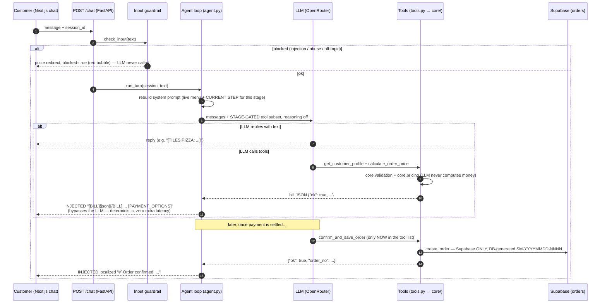
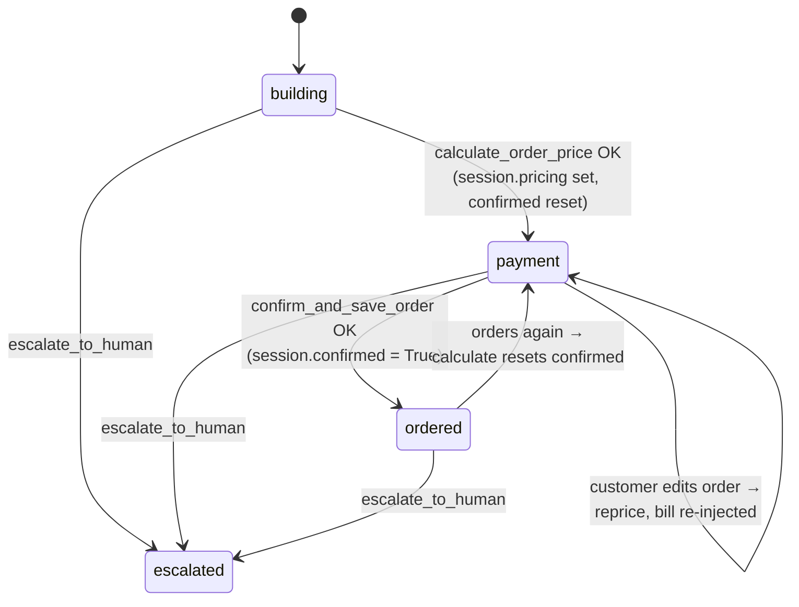

# SliceMatic Chat Architecture — the AI ordering flow, and how to build one like it

> A field guide to the Stage-3 conversational layer: what one order looks like end to end,
> the decisions we took (and why), and the reusable patterns for any "LLM takes a
> structured order / booking / form" use case. Code lives in `ai/` (agent, tools,
> guardrails, session) on top of the frozen `core/` brain.
>
> Verified live 2026-07-03: full order in 8 turns, ~1.3–2.1s per turn after warmup.

---

## 1. The architecture in one picture



Three ideas carry the whole design:

1. **The LLM converses; code decides.** Money, menu truth, validation, and persistence are
   deterministic `core/` + `db/` code. The model never computes or restates a number.
2. **Gate tools by stage, don't beg in the prompt.** The save tool isn't *discouraged*
   early — it isn't *in the tool list* until it's legal. Wrong-time calls become impossible.
3. **Inject deterministic outputs.** When a tool's result is already the final answer
   (a bill, a confirmation), return it directly — skipping the second LLM pass removes
   both latency and the risk of the model mangling the numbers.

---

## 2. One real order, turn by turn (live transcript, 2026-07-03)

| # | Customer | Stage before | Tools called | Reply | Time |
|---|----------|--------------|--------------|-------|------|
| 1 | "hi, I'd like to order a pizza" | building | — | greeting + `[TILES:PIZZA: …12 live pizzas]` | ~1.6s |
| 2 | "Margherita" | building | — | `[TILES:BASE: …6 bases]` | 1.7s |
| 3 | "Cheese Burst" | building | — | `[TILES:TOPPING: …10 toppings]` | 1.7s |
| 4 | "Extra Cheese and Jalapenos" | building | — | asks quantity (1–10) | 1.3s |
| 5 | "2 please, and that's all" | building | `get_customer_profile` + `calculate_order_price` (one round) | **injected** `[BILL]{json}[/BILL] … [PAYMENT_OPTIONS]` | **1.3s** |
| 6 | "UPI" (payment button) | payment | — | `[UPI_QR]` (frontend renders QR + "I have paid") | 2.1s |
| 7 | "I have paid via UPI" | payment | `confirm_and_save_order` → Supabase | **injected** "✅ Order confirmed! SM-20260702-0004 — ₹1500.96 via UPI" | **1.7s** |

Pricing was exact core math: unit ₹636 (base 229 + pizza 299 + toppings 69 + 39), ×2 =
₹1272 subtotal, no discount (qty < 5), GST ₹228.96, **total ₹1500.96**. The Supabase row
carried `source: "chat"`, the session id, the hardcoded profile's `user_id`, and the full
line breakdown in `items` jsonb — and `orders_log.txt` was untouched.

---

## 3. Stages: a state machine derived, not stored

The flow is linear (build → pay → done), but customers aren't — they change their minds,
ask questions, add pizzas after seeing the bill. So the stage is **recomputed from session
state before every LLM call** instead of being a stored step counter. Going "backward"
requires no special handling: if the customer reprices, the state changes and the stage
follows.



Derivation (`agent._stage`, ~8 lines — this is the whole "framework"):

```python
if session.human_escalated: return "escalated"
if session.confirmed:       return "ordered"
if session.pricing:         return "payment"
return "building"
```

### What each stage changes

| Stage | Tools the LLM can see | CURRENT STEP instruction (gist) |
|---|---|---|
| **building** | `get_customer_profile`, `calculate_order_price`, `escalate_to_human` | Pizza → base → 1–3 toppings → quantity; one question at a time; offer `[TILES:…]`; ask "another pizza?"; when done, call profile + calculate **together**; fill every slot a multi-detail message gives. |
| **payment** | building set **+ `confirm_and_save_order`** | Bill/buttons already on screen — don't repeat amounts. UPI → `[UPI_QR]`, Card → `[CARD_FORM]`, Cash/COD → no tag. The moment payment settles, save with the SAME items — don't re-ask. Order edits → reprice. |
| **ordered** | building set (save is gone again) | Saved — do NOT save again. Answer follow-ups; a new order flows building → payment again. |
| **escalated** | building set | A human will follow up; be reassuring. |

Two tools are implemented but **never exposed**: `get_menu` (the live menu is embedded in
the system prompt every turn — a lookup tool would just add a wasted LLM round trip) and
`validate_customer` (subsumed by the profile tool + the output guardrail inside save).

---

## 4. The tools

All five callable tools live in `ai/tools.py` and are thin wrappers over `core/` / `db/`.
Every tool returns a *string* to the LLM; deterministic successes return **JSON** so the
agent can recognise and inject them.

| Tool | Called when | Does | Returns |
|---|---|---|---|
| `get_customer_profile` | order complete (with calculate) | Hardcoded demo profile (stands in for auth); primes `session.name/phone` | profile text |
| `calculate_order_price` | order complete / after any edit | Validates each line (`core.validation`), fuses 1–3 toppings into one `MenuItem` (`_combined_topping`), prices via `core.pricing.compute_bill`; resets `confirmed` | `{"ok": true, lines, cart}` JSON or error text |
| `confirm_and_save_order` | payment settled (**gated**) | Output guardrail → `db.orders.create_order` (**Supabase only**, one row/order, `items` jsonb, DB `order_no`, `user_id` stamped); failure surfaced, order NOT placed | `{"ok": true, order_no, total, payment_mode}` or error text |
| `escalate_to_human` | user upset / asks for human | Flags session, writes `escalations` row + Langfuse link | relay text |
| `get_menu` (internal only) | prompt build, each turn | `core.menu.load_menu` via `api.routes._load_active_menu` (honours admin-uploaded menu; Supabase-ready seam) | menu text |

**Persistence split (decided):** the graded Gradio app owns `orders_log.txt`
(`core.persistence`, unchanged); frontend checkout **and** chat/voice orders are
**DB-only** through the same `create_order` path, listed by `GET /api/orders?phone=`
(interim per-user filter until real auth; then `user_id`).

---

## 5. The staged system prompt

Rebuilt **every turn** (`_set_system_prompt`) so the menu, language, and stage are always
current. Structure (order matters — start and end get the most model attention):

```
1. IDENTITY + LANGUAGE   one persona line; "Respond ONLY in {English|Hindi}"
2. HARD RULES            never compute money · only menu items · 1 line = pizza+base+1-3 toppings+qty
                         profile for name/phone · one tool at a time (exception: profile+calculate)
3. OUTPUT TAGS           every UI tag defined ONCE: [TILES:CAT: …] / [UPI_QR] / [CARD_FORM]
                         "the system shows [BILL]/[PAYMENT_OPTIONS] itself — never write them"
4. FEW-SHOT EXAMPLES     3 mini-exchanges built from the LIVE menu (grader swaps files →
                         names must never be hardcoded); models copy examples ≫ obey prose
5. MENU (fenced)         --- MENU --- {live items+IDs+prices} --- END MENU ---
6. CURRENT STEP          the one stage instruction — the model juggles one step, not six
```

Anti-patterns this replaced (all were live bugs): the same rule stated twice in different
words · format rules filed under a "tools" header · "call get_menu" *and* an embedded menu ·
two different triggers for saving · showing the malformed tag as a "don't" example ·
persona ("chat naturally") fighting procedure ("follow this STRICT sequence").

---

## 6. Sessions

`ai/session.py` — an in-memory dataclass per `session_id` (frontend generates the id):
`history` (OpenAI-shaped messages incl. tool calls), `language` (re-detected every turn —
Devanagari/Hinglish → `hi`), `channel` (chat|voice), `name/phone` (primed by the profile
tool), `pricing`, `confirmed`, `human_escalated`, `voice_started_at` (3-min cap).

- A **per-session `threading.Lock`** serialises turns — no interleaved tool loops.
- Everything mirror-worthy is **best-effort upserted to Supabase** (`sessions`,
  `messages`) as a FastAPI background task *after* the response is sent.
- Stage is **not** a field — it is derived (see §3). One less thing to get stale.
- Known limit (accepted for demo): sessions die on restart and don't share across
  workers. The swap point is Redis; `history` could rehydrate from the messages table.

---

## 7. Guardrails — asymmetric by design

**Input (before the LLM), fails OPEN:** cheap heuristics first (injection regexes, abuse
words, ≤3-word messages and food-words pass free), then a cheap-LLM classifier
(`gpt-4o-mini`, 4 max tokens) only when unsure. A classifier outage lets traffic through —
availability wins, the system prompt is the backstop. Blocked replies return
`blocked: true`, which the chat bubble styles with the `destructive` token
(plum `#A16E83` — the palette has no red) — the visible cue that the guardrail, not the
model, answered.

**Output (inside `confirm_and_save_order`), fails CLOSED:** deterministic `core.validation`
re-checks name / 10-digit 6-9 phone / payment mode / every item id against the live menu /
qty 1–10. Any failure → error text back to the LLM to re-prompt; **nothing is ever
written**. A DB failure is likewise surfaced ("order NOT placed"), and `confirmed` stays
false so the save gate stays open for a retry.

The asymmetry is the guideline: gates that only *read* should fail open; gates that
*write* must fail closed.

---

## 8. Latency engineering (10s → ~1.5s)

Measured levers, in impact order:

| Lever | Where | Why it worked |
|---|---|---|
| Disable hidden reasoning | `_complete`: `extra_body={"reasoning": {"enabled": False}}` | `gemini-2.5-flash` *thinks* by default — seconds per call for a form-filling task that needs none |
| UI injection | agent loop | bill + confirmation turns need **one** LLM round, not two (the second pass only existed to rephrase numbers it must not change) |
| Kill redundant tool round | menu embedded in prompt | each tool round = a full extra LLM call |
| **Real-shaped warmup** | `ai/main.py` lifespan, daemon thread at boot | a bare 1-token "ping" did NOT fix cold start (first real turn still ~6s). The warmup must send the **same prompt + tool schemas** as a live call so the provider's prefix processing/caching is hot. Also warms the guardrail classifier. Runs **once per process boot**, off the boot path (server binds immediately). |
| Off-critical-path writes | chat router / DB | session/message mirrors run as background tasks after the response |
| `[timing]` logs at every seam | STT / TTS / LLM / agent | you cannot fix what you attribute wrongly — our "server is slow" turned out to be ~2s of *client-side* HTTP overhead in one measurement |

Still on the table (deliberately not done yet): SSE streaming of `/chat` (perceived
first-token latency), auth/rate-limiting before public deploy.

---

## 9. Guidelines — applying this to a similar use case

Any "conversation that must end in a valid transaction" (bookings, support intake,
checkout, KYC) can reuse the recipe:

1. **Split conversation from computation.** A pure, framework-free domain core (pricing,
   validation, persistence) that would work with no LLM at all. Tools are thin adapters.
2. **Find the commit point; gate it mechanically.** One tool is irreversible (save/pay/
   book). Expose it only when code-checked preconditions hold — `tools_for(state)` is a
   10-line filter, and it's the reliability you'd otherwise buy a graph framework for.
3. **Derive the stage from state you already track.** No step counter to desync; users
   moving "backward" is free.
4. **Prompt = hard rules + tag spec + few-shot + reference data + ONE current-step
   instruction.** Say each rule once. Build examples from live data, never hardcoded.
5. **Inject deterministic outputs.** If a tool result is final (receipt, confirmation,
   OTP screen), return it verbatim — don't pay an LLM pass to (mis)copy numbers.
6. **Embed small reference data in the prompt; delete the lookup tool.** A tool round
   trip costs a whole LLM call. (Seam: if the data outgrows the prompt, the fenced block
   makes it easy to truncate and re-add the tool.)
7. **Guardrails: fail open on reads, fail closed on writes.**
8. **Idempotency at the gate.** After a save, the commit tool disappears (`confirmed`)
   until a new priced state exists — double "I have paid" cannot double-write.
9. **Warm the real path at boot** — full prompt + tools, not a toy ping — on a background
   thread, once per process.
10. **Instrument first, optimize second.** Timing logs at every hop; our biggest "fix"
    (reasoning-off) came straight from one log line.
11. **Skip agent frameworks until proven otherwise.** LangChain/LangGraph call the same
    endpoint with the same schemas; they cannot make the model decide faster or better.
    The three things that mattered — gating, injection, staged prompt — are ~60 lines of
    plain Python on the OpenAI SDK, and observability (Langfuse drop-in) stayed intact.
12. **Multi-model fallback at the app level.** PRIMARY → FALLBACK1 → FALLBACK2 per call;
    a provider outage degrades latency, not availability.

---

## 10. Decision log (quick reference)

| Decision | Choice | Rejected alternative |
|---|---|---|
| Orchestration | Plain OpenAI SDK on OpenRouter + own ~60-line stage logic | LangChain (same wire calls, lost tracing), LangGraph (framework for a 4-state machine), strict code-wizard (loses multi-slot NL like "2 Margheritas on thin crust with olives") |
| Wrong-tool-call prevention | Stage-gated `tools_for(session)` | Prompt-only rules ("call ONLY after…") — measured unreliable |
| Bill / confirmation rendering | Backend injection (`[BILL]` JSON, localized confirm text) | LLM reads tool result back — slower, mangles numbers |
| Customer identity | `get_customer_profile` (hardcoded, = frontend `CURRENT_USER`) | Asking name/phone in chat (`validate_customer` retired from exposure) |
| Menu access | Embedded in system prompt each turn via `_load_active_menu()` (Supabase-ready seam) | `get_menu` tool (wasted round trip) |
| Chat/voice persistence | Supabase only (`create_order`: 1 row/order, `items` jsonb, DB `order_no` `SM-YYYYMMDD-NNNN`, `user_id`) — failure surfaced | `.txt` + best-effort mirror (`.txt` stays the graded Gradio app's output) |
| Orders listing | `GET /api/orders?phone=` (interim; `user_id` after auth) | — |
| Model params | temp 0.2, reasoning off, max_tokens 1000 chat / 160 voice | temp 0.5 "warm persona" (format discipline matters more once numbers are injected) |
| Voice | same agent, channel-aware: no tags, no bill injection (TTS must never speak JSON), model reads back only the total. Voice **UI** is currently disabled (`VOICE_ENABLED = false` in `composer.tsx`); backend `/voice/*` stays live | separate voice agent |

---

*Related: `CLAUDE.md` (Stage-3 status + conventions) · `docs/STAGE3_PLAN.md` ·
`docs/API.md` · `ai/agent.py` / `ai/tools.py` / `ai/guardrails.py` / `ai/session.py`.*
