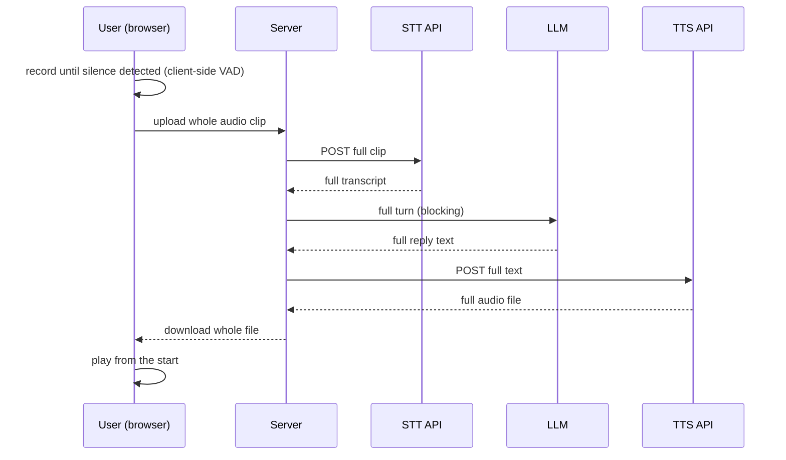
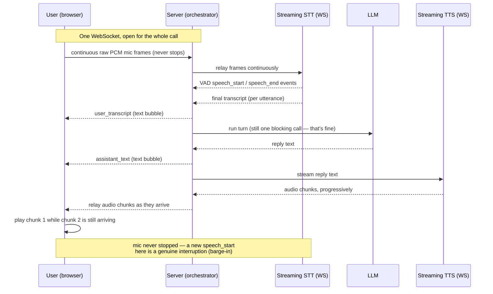

# Real-Time Voice Agent Architecture — a reusable field guide

> How to make an LLM voice agent feel like an actual phone call instead of "text-to-speech read
> aloud with a long pause first." Provider-agnostic concepts (Sarvam is used as the worked example
> and case study, since that's what was validated live for this project — swap in Deepgram/
> AssemblyAI/ElevenLabs/OpenAI Realtime/etc. and the shape barely changes).
>
> Companion to `CHAT_ARCHITECTURE.md` (text-agent patterns). This one is voice-specific: streaming
> audio in both directions, turn detection, and interruption.

---

## 1. The problem: why "batch" voice pipelines feel robotic

The obvious way to bolt voice onto an existing chat agent is a **batch relay**:



Every arrow with "full"/"whole" is dead time the caller sits in silence for. Even if each leg is
individually fast (sub-2s), they're serial and each one blocks on completion before the next starts —
a 3-sentence reply can easily mean 4-6 seconds of silence after the user stops talking. This is the
single biggest lever on "does this feel like a phone call," and it has nothing to do with prompt
wording — a perfectly natural-sounding reply still feels robotic if there's a multi-second dead-air gap
before and during it.

The secondary problem: client-side turn-taking (watching mic RMS via `requestAnimationFrame` to detect
when the user stopped talking) is fragile — browsers throttle/pause `requestAnimationFrame` in
backgrounded tabs, so if the user alt-tabs mid-call, silence detection just stops.

## 2. The fix: full-duplex streaming



Two independent wins, and you can ship either one alone:

1. **Streaming STT** removes "upload → wait for whole transcript" and moves turn-detection
   server-side (fixes the backgrounded-tab fragility for free, since it's no longer client-driven).
2. **Streaming TTS** removes "wait for the whole reply's audio to generate" — the user hears the
   first syllable within a few hundred ms of the reply text being ready, not after the whole clip
   renders.

Neither requires the LLM call itself to stream token-by-token. A blocking, well-tested agent loop
(tool-calling, business logic, guardrails) can stay exactly as it is — you're only changing the audio
transport on either side of it. This matters: don't rewrite your agent's control flow to chase voice
latency. The dead air was almost entirely in the STT/TTS legs, not the LLM call.

## 3. Core concept: one browser WebSocket, bridging two provider WebSockets

The browser talks to **your server** over one WS (never directly to the STT/TTS provider — that would
leak API keys client-side). Your server holds **two more WS connections** to the provider: one for STT,
one for TTS. Your server's job is almost entirely *relaying bytes between three sockets*, plus running
the agent turn in between.

```
Browser  ⇄  Your server  ⇄  Provider STT (WS)
                          ⇄  Provider TTS (WS)
```

**Golden rule for any WebSocket you own:** exactly one task/coroutine may call `send()` and exactly one
may call `recv()`/`receive()` on a given socket at any time — most WS libraries (browser and server
side) aren't safe for concurrent writers. If multiple parts of your system need to send on the same
socket (e.g. JSON control messages *and* binary audio chunks, from different logical sources), funnel
them through **one outbound queue drained by one writer task**, rather than calling `send()` from
several places.

## 4. Core concept: server-side VAD beats client-side VAD

Client-side voice-activity detection (watch mic volume via Web Audio's `AnalyserNode`, decide "silence
for N ms = end of turn") is the default naive approach, and it has two problems: it's CPU work + timer
callbacks that browsers throttle when the tab isn't foregrounded, and it duplicates logic the STT
provider almost certainly already does *better* internally (real VAD models, not an RMS threshold).

Modern streaming STT APIs emit **turn-boundary events over the same socket** (commonly named
`speech_start`/`speech_end` or similar) with tunable sensitivity (e.g. a "silence for 500ms = end of
turn" style knob). Prefer this over rolling your own — it's one less subsystem to keep alive across
tab-visibility changes, and it's the provider's problem to keep it accurate.

**Design implication:** the mic stream is continuous and never stops for the whole call — you're not
recording discrete clips anymore, you're piping a live stream. "Recording a turn" becomes purely a
server-side bookkeeping concept (which events happened between two VAD boundaries), not a client-side
start/stop action.

## 5. Core concept: browser microphone capture — raw PCM, not `MediaRecorder`

`MediaRecorder` (the obvious/default browser recording API) encodes to a container format —
`audio/webm;codecs=opus` in Chrome. Most streaming STT APIs want **raw PCM** (commonly 16-bit signed
little-endian, mono, 16kHz), not webm/opus, and don't support arbitrary container formats over a
streaming socket. Rather than transcode client-side (expensive, needs WASM), **capture raw PCM directly**
using an `AudioWorkletProcessor`:

- `AudioWorkletProcessor.process(inputs)` hands you `Float32Array` samples at the `AudioContext`'s
  **native** sample rate — read the actual `sampleRate` global inside the worklet; don't assume 48000,
  and don't trust `new AudioContext({sampleRate: 16000})` to be honored cross-browser.
- Downmix to mono if there are 2 input channels (average them).
- Downsample to the target rate (commonly 16000Hz) via linear interpolation, carrying the fractional
  phase across `process()` call boundaries (render quanta are fixed-size, typically 128 samples, and
  won't align with either your resample ratio or your chunk size):
  ```
  ratio = nativeRate / targetRate
  for j in 0..outLen-1:
      srcPos = j * ratio + carryPhase
      i0 = floor(srcPos); frac = srcPos - i0
      out[j] = in[i0] * (1 - frac) + in[i0 + 1] * frac
  ```
  This is standard practice for speech-quality audio — no anti-aliasing filter needed at this bar.
- Convert Float32 (-1..1) to Int16 (`clamp(x,-1,1) * (x<0 ? 0x8000 : 0x7fff)`).
- Buffer into fixed-size chunks (~20ms is a good default — matches typical VoIP framing) and
  `postMessage` each as a **transferable** `ArrayBuffer` to the main thread, which just forwards it to
  the WebSocket (`ws.send(buffer)`) — no processing on the main thread.
- Gotcha: connect the worklet node to a (zero-gain) path to `destination`, even if you never want to
  hear it — some browsers stop calling `process()` on a node with no path to an active audio output.

No extra npm dependency needed for any of this — it's all native Web Audio API.

## 6. Core concept: streaming playback — pick the format that avoids "can I decode this chunk alone?"

This is the part most likely to trip you up. A streaming TTS socket hands you audio in small chunks as
they're generated — but can the browser actually *play* an arbitrary chunk the instant it arrives?

| Approach | Works when... | Problem |
|---|---|---|
| `MediaSource` + `<audio>` (`SourceBuffer.appendBuffer`) | Chunks are valid fragments of a browser-parseable container (fMP4/WebM) | Most streaming TTS chunk boundaries aren't guaranteed to land on container-fragment boundaries; MSE codec support (esp. for audio-only formats) is inconsistent across browsers |
| `AudioContext.decodeAudioData()` per chunk | Each chunk is an independently-decodable, complete container (e.g. each chunk happens to be its own full WAV with header, or a self-framed codec) | Fails if the provider splits mid-frame; async and relatively heavy per chunk |
| **Raw PCM chunks → manual `AudioBuffer` → `AudioBufferSourceNode` queue** | The provider can emit **headerless raw PCM** (ask for it explicitly — e.g. a `linear16`/`pcm` output option) | None, if raw PCM is available — this is the one that just works |

**Recommended, and what a live test against Sarvam's TTS streaming API confirmed:** request raw PCM
output explicitly (their `output_audio_codec="linear16"` option → `content_type: audio/pcm` in the
response, confirmed via a real API call, not just documentation). Each chunk is then trivially:

```ts
function pcm16ToAudioBuffer(ctx: AudioContext, bytes: ArrayBuffer, sampleRate: number) {
  const int16 = new Int16Array(bytes);
  const buf = ctx.createBuffer(1, int16.length, sampleRate);
  const ch = buf.getChannelData(0);
  for (let i = 0; i < int16.length; i++) ch[i] = int16[i] / (int16[i] < 0 ? 0x8000 : 0x7fff);
  return buf;
}
```

Schedule gapless playback with a running cursor:

```ts
let nextStartTime = ctx.currentTime;
function playChunk(buf: AudioBuffer) {
  const src = ctx.createBufferSource();
  src.buffer = buf;
  src.connect(ctx.destination);
  const startAt = Math.max(nextStartTime, ctx.currentTime);
  src.start(startAt);
  nextStartTime = startAt + buf.duration;
  activeSources.push(src);
}
```

**Why this also wins for barge-in:** stopping is `for (const s of activeSources) s.stop(0)` — every
scheduled and playing buffer halts within a few samples. Neither MSE nor `<audio>` has an equivalent
instant-abort primitive (`SourceBuffer.abort()` + fiddling with `currentTime` is clunkier and flakier).

**If the provider genuinely can't give you raw PCM:** many TTS streaming APIs default to MP3. This is
less bad than it sounds for browsers that support MSE with `'audio/mpeg'` (Chromium does) — MP3's frame
format is inherently self-synchronizing/streamable (this is literally how internet radio streaming has
worked for decades), so appending arbitrary MP3 byte ranges to a `SourceBuffer` tends to work even
without perfect frame alignment. It's a reasonable fallback, not the first choice — verify raw-PCM
availability first, it's simpler and has no browser-support caveats.

## 7. Core concept: barge-in (interruption) and the "you can't kill a thread" trap

Barge-in = the user starts talking while the assistant is still speaking, and the assistant should shut
up immediately and listen, like a real conversation. Since the mic never stops (see §4), you already
have the *signal* for free: a new VAD speech-start event while a reply is still playing. The design work
is in reacting to it correctly.

**On the frontend:** a `barge_in` message just means "stop and clear the playback queue" — trivial with
the raw-PCM `AudioBufferSourceNode` approach from §6.

**On the backend, there's a real correctness trap.** If your agent turn runs as a blocking call handed
off to a thread pool (`asyncio.to_thread` in Python, a worker thread in Node, etc.) so it doesn't block
your event loop, **cancelling the `async` task that's awaiting that thread does NOT stop the underlying
OS thread.** Threads aren't preemptible. So on barge-in:

- The *old* turn's blocking LLM call keeps running to completion in the background, and will eventually
  try to append its result to the shared conversation history / mutate shared state — even though
  nothing is "waiting" for it anymore.
- If the *new* turn starts a second blocking call concurrently against the same mutable state (e.g. a
  conversation history list), you get **corrupted or interleaved state** — a real bug, not a hypothetical
  edge case, and one that's easy to ship without noticing because it only shows up under a fast
  double-turn (exactly what barge-in causes).

**The fix (no changes needed to the agent's own logic):**
1. Keep a per-conversation lock around "read guardrail + run the LLM turn + mutate history" (you likely
   already have this for normal serialized turns) — this prevents concurrent *mutation*, so state
   corruption can't happen even if a stale thread is still running.
2. Tag every turn with an incrementing `turn_id`. Before acting on a completed turn's result (sending it
   to TTS, pushing it to the UI), check `if turn_id != current_turn_id: discard`. This is what actually
   makes barge-in *feel* instant: the user never hears the stale reply, even though the stale computation
   quietly finishes in the background and its result is thrown away.
3. Net effect, worth stating as a deliberate tradeoff rather than hiding it: audio stops **instantly**
   (that's genuine async I/O you can cancel), but the *next* turn's LLM call may have to wait up to one
   full round-trip for the stale thread to release the lock before it can start. A "true" fix would need
   the agent loop itself to accept a cancellation token it polls between steps — only worth doing if
   you're touching that code anyway; don't rewrite well-tested agent internals just to shave this bound.

**Also decide: does the TTS provider connection get reused across turns, or opened fresh per turn?**
Unless the provider's protocol documents an explicit "cancel/abort the current synthesis" message,
prefer **one fresh TTS connection per assistant turn**, closed on completion *or* cancellation. Then
barge-in cancellation is just "close this turn's socket" (`task.cancel()` inside an `async with` — the
context manager's exit handles it), which by construction cannot leak stale audio bytes into the next
turn. The cost is one extra connection handshake per turn (~100-300ms) — cheap relative to the LLM call
you're already paying for, and it eliminates a whole class of "did leftover audio from the last turn
bleed into this one" bugs. Reusing one long-lived STT connection for the whole call is fine (and often
better, since turn-taking is expressed as events *within* it, not connection boundaries) — this
reuse-vs-fresh distinction is specifically about the "cancel mid-generation" hazard on the TTS side.

## 8. Core concept: server-side asyncio task topology (or the equivalent in your runtime)

A clean shape for the per-call orchestrator, generalized beyond any one language:

```
one call
 ├─ reader task     : the ONLY task reading the browser socket
 ├─ writer task     : the ONLY task writing the browser socket, draining one outbound queue
 ├─ stt-event task  : iterates the STT connection's events for the whole call
 ├─ cap task        : a timer for any hard call-duration limit
 └─ turn task       : 0 or 1 alive at a time — created and cancelled by the stt-event task
                       on every new final transcript (a new transcript always supersedes
                       whatever's in flight; no work queue needed, just "replace the handle")
```

The **turn task** is where §7's turn-id/lock/fresh-TTS-connection logic lives. Everything it wants to
send to the browser (text bubbles, audio chunks) goes through the shared outbound queue — never a
direct `send()` call from inside it, per the golden rule in §3.

## 9. Message envelope: mixing control JSON and binary audio on one socket

One WebSocket, two payload kinds — this works fine, just be explicit about framing:

**Client → server:** first message is always a text/JSON auth/session-init frame (a WS handshake can't
carry custom headers from a browser, so identity/session info rides in-band as the first message, not a
query param — avoids tokens landing in server access logs). After that: binary frames = raw mic PCM;
occasional JSON control messages (`mute`, `end_call`, etc.).

**Server → client:** JSON control messages (`ready`, `vad signal`, `user_transcript`, `assistant_text`,
`assistant_audio_end`, `barge_in`, `call_ended` with a reason, error diagnostics) interleaved with binary
frames = raw TTS PCM. Push `user_transcript` and `assistant_text` **the instant each is known** —
independently of the audio — so the UI's text thread updates immediately even while audio is still
streaming in behind it.

Always give `call_ended` a **reason** (`user` hangup, cap reached, upstream provider unavailable,
connection lost, server error). Silent disconnects are indistinguishable from bugs during testing.

## 10. Mitigate acoustic echo / self-triggered barge-in

Continuous mic capture + simultaneous speaker playback, with no telephony-grade echo cancellation, means
the assistant's own voice coming out of the speakers can be picked up by the still-open mic and
misread as the user interrupting — a self-triggering loop. Cheap mitigations, worth doing from day one:

1. Request browser-native echo cancellation on the mic stream: `getUserMedia({ audio: { echoCancellation:
   true, noiseSuppression: true, autoGainControl: true } })`. Not perfect on every OS/browser/headset
   combo, but free and the standard first line of defense.
2. A short grace period (~300-400ms) after TTS playback starts, during which a VAD speech-start event is
   *not* treated as real barge-in — genuine user interruptions this early are rare, self-echo is not.
3. **Test with real speakers, not headphones**, as one of the very first end-to-end checks — this
   determines whether the demo even works, not a polish item to defer.

## 11. Ship it safely: keep the old path as a fallback

This is a from-scratch rewrite of both the client audio pipeline and a chunk of the server. Gate it
behind a flag (env var / feature flag) that can fall back to the previous batch/REST implementation
without a code rollback, and keep the old implementation's file around verbatim rather than deleting it
in the same change. Cheap insurance for a feature this novel.

## 12. Decision checklist — is this worth building?

Build the full streaming version when: the product genuinely is a live conversational voice
experience (phone-call analog, live agent, hands-free assistant) where per-turn dead air and the
ability to interrupt are core to the experience.

A simpler batch/REST pipeline (record on silence → one STT call → one LLM call → one TTS call → play)
is still the right choice when: it's an occasional voice *input* to an otherwise text-first flow (e.g.
"tap mic to dictate one utterance"), where a beat of processing latency reads as normal rather than
broken — don't over-engineer past what the interaction actually needs.

## 13. Case study — applied to SliceMatic (pizza-ordering voice agent)

- **Provider:** Sarvam AI (`sarvamai` Python SDK) — `saaras:v3` for streaming STT (server-side VAD,
  `high_vad_sensitivity`, `vad_signals` events), `bulbul:v3` for streaming TTS (native Hindi/English
  code-mixing in one voice — no separate per-language model swap needed for Hinglish).
  **Verified live** (not just from docs): `output_audio_codec="linear16"` really does return headerless
  raw PCM (`content_type: audio/pcm`), and a real speech clip round-tripped through the STT socket
  produced correct `START_SPEECH`/`END_SPEECH` events and a transcript.
- **Backend:** a new `CallSession` orchestrator (§8's task shape) bridging one browser WebSocket to one
  persistent Sarvam STT socket (whole call) and one fresh Sarvam TTS socket per assistant turn. The
  existing, well-tested blocking agent loop (tool-calling, pricing, order-saving) was reused completely
  unmodified — only the audio transport around it changed.
  - `turn_id` + the existing per-session lock solved the stale-thread race from §7 with zero changes to
    the agent's own code.
- **Frontend:** `AudioWorkletProcessor` PCM capture replaced `MediaRecorder`; a raw-PCM
  `AudioBufferSourceNode` queue replaced "download whole file, play with `<audio>`". The existing call-UI
  component needed no changes — the new implementation was written to preserve the old hook's exact
  exported shape.
- **Kept as fallback:** the original batch/REST endpoints and the original client call-machine, gated
  behind a mode flag, per §11.
- **Prompt-level companion change:** the voice system prompt was updated to explicitly permit natural
  Hinglish code-switching (rather than forcing a rigid single-language reply) and to spell out numbers
  with comma separators for correct TTS pronunciation — small, additive changes, unrelated to the
  transport rewrite but shipped alongside it since both serve "sounds like a real phone call."

---

*Related: `CHAT_ARCHITECTURE.md` (the text-agent patterns this voice layer sits on top of — stage-gated
tools, deterministic injection, guardrails). This document is the voice-transport layer; the agent/turn
logic underneath is unchanged by anything here.*
